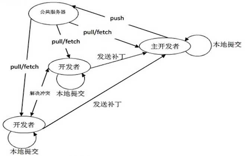

# 1.1 真实的公司组织结构及研发流程


- 余泽斌
  - 十九年互联网研发经验，从 2000 年开始从事互联网技术研发工作，历经 PC 互联网、Web 2.0、移动互联网等整个互联网发展历程，研发过社区、电商、软件、游戏、广告等众多高并发业务系统，累计为几十亿互联网用户提供过服务，历任多家公司核心研发、技术总监、技术副总等岗位。
  - 工作中用过的语言：C/C++/ObjC、Java、C#、JavaScript、PHP、Python、Shell、ASP、Lua

## 项目课程（10天）

- 1.1：真实的公司组织结构及研发流程、Git

- 1.2：开始一个新Git项目、前后端分离开发

- 1.3：验证码、缓存、登录、表单验证

- 1.4：上传文件、异步、初始化脚本

- 1.5：social接口

- 2.1：会员、权限、日志、Redis

- 2.2：缓存、排行榜、积分接口

- 2.3：分布式数据库、集群、高可用、压测

- 2.4：SSH、部署、脚本

- 2.5：WebServer、负载均衡、服务器架构
- 有空余时间，专门讲一下数据分析系统在公司中的应用

## 项目概览

Swiper Social 是一个类似于 “探探” 的社交类程序, 采用前后端分离结构, 主要包含以下模块：

1. 个人模块：注册、登录、查看资料、修改资料、上传照片
2. 社交模块：喜欢、超级喜欢、不喜欢
3. VIP 模块：反悔
4. 异步任务模块：把比较耗时的，没必要让用户等的任务异步处理
5. Redis 缓存模块：**对频繁读取的，更新很少的数据**，放入缓存，减轻数据库压力
6. 日志模块、异常处理模块
7. 短信模块、邮件模块
8. 运维、部署、shell 脚本
9. 前端模块
10. 其他


## 项目目标

1. ✓ 了解真实项目的开发流程
2. ✓ 掌握如何使用 Git 完成协作开发和代码管理
3. ✓ 掌握 **RESTful** 的概念, 掌握前后端分离式的开发
4. ✓ 掌握数据库关系建模, 及不使用外键如何构建关系
5. ✓ 掌握缓存的使用
6. ✓ 掌握 Redis 不同数据类型的用法: **sorted set(zset)**
7. ✓ 掌握 Celery 异步任务处理
8.  ✓ 掌握日志的使用
9.  ✓ 掌握 Nginx 的配置, 及负载均衡的原理
10.  ✓ 了解数据库优化、分布式数据库及数据分片
11.  ✓ 掌握服务器异常处理, 及报警处理
12.  ✓ 熟练掌握常用 Linux 命令, 以及初级 bash 脚本的开发
13.  ✓ 掌握线上服务器的安装、部署
14.  ✓ 对**服务器架构、服务高可用**等有一个初步认识


## 企业中的组织结构

- 股东：出钱成立公司的人

  - 董事会：股东中选出董事会，董事会代表股东行事，董事会**聘用**管理层来管理公司
  - 监事会：监事会负责监督董事会
  
- 组织结构

  - 高层 - **战略**职能：
    - 核心高层四个 **O**：**CEO**（总管，可能是老板，也可能是高级打工者）、**CFO**（管钱）、**COO**（管市场运营）、**CTO**（管产品技术）
      - 总裁(集团)、CEO(单个公司)谁大
    - 其他高层：总裁、VP 副总、HRD
  - 中层 - **管理**职能：各部门总监、部门经理、负责人
    - 有的公司弱化中层，纯管理岗位的人少
  - 基层 - **执行**职能：经理、主程、Leader、主管、执行、程序员

- 人力资源部门：HRVP / HRD / HRM 负责

  - 制定用人制度, 负责人员的流入流出，简言之：招聘、离职
  - 制定绩效考核制度, 审批薪酬表，简言之：薪资
  - 负责人力资源发展，简言之：培训
  - **每个求职者都要经过人力面试**

- 行政部门：COO负责 / HRD负责

  - 日常办公、卫生管理, 会议、活动管理
  - 内部物品、设备的预算和购置
  - [内网、IT]

- 财务部门：CFO负责，一般 CFO 兼董秘（董事会秘书）

  - 资产管理、预算及成本管理、风险管控
  - 薪酬管理，税务
  - 上市、财报管理
  - 投融资

- 市场部门：COO负责

  - 负责经济的花钱，拉新用户

- 运营部门：COO负责

  - 负责做产品和活动，留住用户

- 研发部门：CTO负责 技术总监

  - 产品总监：为了产品独立性会把产品独立出去，为了产品有足够的话语权，不受纯技术方向的影响，与技术对等
  - 产品人员：负责思考产品
    - 设计人员：负责设计产品
  - CTO - 战略职能（方向、大战略、领军人物）
    - 前端技术总监（某个方向的带头人和负责人）
    - 后端总监
    - 视频公司：编解码技术总监
    - 工程总监(真实系统的实施)
    - 技术副总（实施和实现）
  - 技术：负责实现产品
    - 大前端开发：用户交互和展现
      - HTML5 (3~4人)、小程序
      - iOS (3~4人)需求较少
      - Android (3~4人)需求很多
      - 优化用户体验
    - **后端开发**：更多是出API，给数据
      - Python / PHP / Java / Go (4~8人)
      - 服务器架构设计
        - 分布式
        - 集群
        - 高并发
      - 优化用户体验
    - 运维：实施、监控、安全
      - 服务器架构的实施
      - SA：System Administrator（ **Linux 占 95%**，**Windows 占 5%** ）
      - 网络安全：
      - [ DBA ] 现在很少独立岗位了，只有银行、传统制造业信息中心、ERP（制造企业用的管理系统Enterprise Resource Plan），这样的传统公司有独立的 DBA 岗
    - 测试：大公司很多测试岗外包了，测试越来越成为一个专业的独立业务，独立外包
      - 白盒测试：针对代码写测试
      - 黑盒测试 (1~2)：功能测试
      - 接口测试：后端写的是API，给的是数据，相应的就有接口的测试
      - 压力测试：
      - 自动化测试：前端界面丰富多彩，人力测试成本很高，想办法自动化测试
    - 数据分析
      - 大数据分析
      - 为企业决策提供支撑
      - 偏技术：工程岗、技术岗：系统部署、ETL(数据抽取、转换、加载)，偏技术的岗位负责为偏业务的岗位提供数据
      - 偏业务：算法岗、分析岗：用 Excel、SQL、SPSS、PowerBI 在工程岗搭建好的系统上，做统计分析

- 组织结构各个公司都有差别，面试的时候可以问

- **互联网公司运转的本质**：围绕用户进行

  - 1. 拉新：找来更多新用户，市场负责、网络营销、增长黑客；
  - 2. 留存/转化：产品、运营负责，产品运营设计方案，研发实现；
  - 3. 付费、转化率：运营负责，设计方案，研发实现：
    
    - toC client的，用户付费：前端付费；
    - toB business的，广告主企业主付费：后端付费；

- 成本中心：花钱的

  - 研发、市场

- 效益中心：挣钱的

  - 运营（包含研发）

- 以上部门众多，跨部门沟通有壁垒，怎么办？

  - 打散部门壁垒，相关职能合并到一个项目组
  - 游戏里的工作室
  - 公司里的项目组就是这样的
  - 项目经理：
    - 产品、运营、美术
      - 技术：前端、后端、架构、运维、增长、数据合为一个 Team
  
- 面试题：

  - 你们公司多少人？
  - 你们组多少人，都负责什么工作？

  


## 工作中的项目开发流程

1. **立项阶段**：市场可行性分析，立项报告，立项会议
  1. 如果你去的公司，没有立项，直接开始，就要小心了。
     1. 推动立项
     2. 呆的越久越浪费时间，赶紧思考后路
2. 需求讨论：讨论并明确大的需求，大家达成**理解一致**，项目**目标一致**，各自分工准备
3. 原型设计、概要设计阶段：
   1. 产品人员进行原型设计, 提出详细的开发需求
   2. 需求文档：产品出需求文档(用户流程、高保真产品原型，各种异常分支如何提醒用户)，详细需求讨论会，产品出原型图
   3. 概要设计：技术出概要设计
     1. 数据结构、数据库、基于团队的经验和能力选定框架
     2. 实验性项目：尝试一些新技术：PostgreSQL
   4. 有经验的架构师确定框架和基础库
4. 工作分工：分解需求，大体确定工期，阶段计划，迭代方式(Scrum)，迭代节奏，有详细设计文档
5. 排期：甘特图
6. 迭代阶段：
   1. 以下进入**迭代**周期（敏捷开发**Scrum流程**，2-3周）：
   2. 迭代的第一个和第二个周期，一般是项目启动，导入设计阶段：
      1. 同步技术做前期技术设计准备：框架、数据结构，分到具体模块的人思考一下如何设计
      2. 框架搭建、搭建测试环境
         1. 数据库搭建
         2. 测试web环境搭建
      3. 设计：美术、技术，设计人员进行 UI、原画等绘制工作；
   3. 产品负责人PO：**确定**本期详细需求：这次迭代要完成哪些工作，**需求固化**，保证大家**理解一致**，宁可多花时间，达成理解一致
   4. 每日站会，站着不困，时间15分钟，需求不清晰，要讨论的，单独开会讨论：

      1. Scrum Master角色：组织Scrum流程，技术  leader 兼任
      2. 每个人看白板分工：工作分三个区域：**todo**(即时贴)、**doing**、**done**
         1. **每日站会要说清楚三个事情：**
            1. 昨天我做了什么：
               1. 需求讨论、分析
               3. 接口定义
               6. 模块设计
               7. **模块编码**
               8. 联调、测试
            2. 今天我计划做什么
            3. 我需要的**外部支援**，团队一起帮助我协商解决：
               1. 前置条件：等图、等需求、需要讨论确定
               2. 难度过大，自己搞不定，需要外部支持
               3. 有个前置条件还没弄清楚
               4. 顺利工作需要的外部条件：测试环境、需要xxx角色配合测试
         2. 燃尽图：未完成功能点的指示图
         
      3. 前后端人员协作，做好接口标准约定，写**接口设计文档**，编写接口文档，**后端主导写接口**
      4. **工时最长的编码部分**：前后端同时开始开发各自功能
      5. 联调：前后端联合调试
      6. 部署到测试环境，测试人员测试，开发内部兼任测试
   5. 上线部署[服务重启]、新功能发布、发布后跟踪
   6. 迭代周期结尾：**总结本次迭代优缺点**
   7. 开始下一个迭代需求讨论
   8. 可参考的流程方式：

      1. **瀑布式**：需求分析、设计、编码（4-5个月）、测试、上线、完成
         1. 周期比较长，比如3-6月，6月-12个月
      2. XP：极限编程，特点是结对编程，对学习型任务，提高成员水平，帮助极大
      3. **Scrum**：目前主流采用的方法，上面讲的基本就是Scrum的迭代流程
         1. 周期缩短，每个短周期交付一小部分工作
         2. PO：product owner 团队里的产品全权负责人：游戏工作室
         3. Master：团队迭代的管理者，tech leader 兼任
      4. **Kanban**：新兴方法
7. 合理项目的研发流程的时间占比：

   1. 我们真正的价值在：需求分析、设计、写文档：时间占1/3，价值占1/2
   2. 编码：仅仅是把我们的价值展现出来，时间占1/3，价值1/3
   3. 联调、测试，复盘：这一部分价值不够高，时间占1/3，价值1/6
8. 不合理的项目流程：不具有可持续性

   1. 需求：一个人说了算，不占时间
   2. 编码：80%，自己挤出时间设计，写必要的文档
   3. 测试：20%
9. **明确交付的标准**
   1. **订好验收标准**
      1. 交付的不是自己简单完成功能的模块
      2. 而是多方验证无误，达成需求的，健壮的模块
   2. 这会影响别人对你的预期，靠谱的预期
      1. 所以我们要**管理别人对我们的预期**
      2. 这取决于我们自己的行动
         1. 不要给别人过高的承诺
            1. 不要什么任务都接
         2. **承诺了就要尽力达到**
         3. 尽力达成**比别人的标准更高**一些
10. 实际上，项目时间都是弹性的

  1. 技术是能**争取来时间做分析和设计**的
11. 面试题：
   1. 你们怎么开发协作？你工作中跟什么角色协作，怎么协作，输入输出都是什么，用什么工具协作？
      - 开发与开发之间：用**git协作**，输入和输出都是代码
      - 产品与开发之间：**在线文档**协作，产品输出原型图给到研发
      - 研发与测试之间：bug管理工具（Jira/禅道/Tower/Bugfree），测试提交bug，研发修复bug
      - 研发与运维之间：
        - 提交代码和**安装**脚本
        - CI持续集成/CD持续部署，等自动化流程工具
        - Docker容器方案


## 绩效管理制度

1. KPI：传统工厂用的多，被研发公司借用，绩效主义毁掉了索尼，KPI如何毁了索尼
   1. Key performance indicator
   2. 如果KPI合理，KPI让你专注你的核心业务目标
   3. 你就负责一个核心业务数字：新用户数
   4. 微博营销，定的KPI就是粉丝数
   5. 游戏业务：
      1. 三消：
         1. 2年，20，480元
         2. 收入，搞很多高收费活动128，256的礼包，跑了
2. OKR：Google首倡
   1. O：Object 
   2. KR：Key Result
   3. 兴起于 Google，被各大互联网公司竞相仿效
      1. 你的Object，根据你leader的Object,......,根据CEO的Object
      2. 带来一个好处，整个公司的目标一贯而下
      3. 按季度或半年：
         1. 按季度
            1. CEO的目标：增加公司价值
               1. KR：1. 提高用户数，+5%
               2. KR：2. 提高用户活跃，+5%
               3. KR：3. 提高收入，+5%
            2. CTO的目标：提高服务响应速度，提高团队研发效能
               1. 提升服务器速度，+10%
               2. 提高团队效能产出，交付故障率 -5%
            3. 后端的目标：提高服务器响应速度，减少bug
               1. KR1：服务器加速，+10%
               2. KR2：bug减少， 关键交付，bug数小于3
         2. 按季度：
            1. CEO的目标：稳定增收
            2. CTO的目标：提高速度，提高效能，降低损耗，节约服务器
            3. 研发：减少服务器，提高效率
         3. 按季度：
            1. CEO目标：提高用户数
            2. CTO目标：加服务器，提升新用户体验
            3. 研发：扩容
      4. 把Object分解为Key Result

1. 面试题：你们怎么做绩效？你参与过，被考评过，至少知道一部分。


## Git 命令回顾



- **`init`**: 在本地创建一个新的库，与 clone 互斥
- **`clone`**: 从服务器克隆代码到本地 (将所有代码下载)，与 init 互斥
- **`status`**: 查看当前代码库的状态
- **`add`**: 将本地文件添加到暂存区
- **`commit`**: 将代码提交到本地仓库
- **`push`**: 将本地代码推送到远程仓库
- **`pull`**: 将远程仓库的代码拉取到本地 (只更新与本地不一样的代码)
- **`branch`**: 分支管理
- **`checkout`**: 切换分支 / 代码回滚 / 代码还原
- **`merge`**: 合并分支
- **`log`**: 查看提交历史
- **`diff`**: 差异对比
- **`remote`**: 远程库管理
- **`.gitignore`**: 一个特殊文件, 用来记录需要忽略哪些文件
- ssh-key 的使用

1. github操作

   1. 登录 github.com
      1. 注册、验证邮箱
   2. 点 + 号，创建新项目
      1. public
      2. gitignore：python
      3. license: MIT
      4. create Readme.md
   3. copy 项目地址：

2. 本地操作

   1. 打开命令行窗口

   2. cd到自己的工作目录

   3. git **clone** https://github.com/yuzebin/bj-py1903.git

      1. gcl 

   4. 修改readme.md文件，增加一点内容

   5. git add .

   6. git commit -m "some change"

   7. git push

   8. git branch

   9. git branch --create develop

   10. git checkout develop

   11. 修改 readme.md，增加在分支中的内容

   12. git add .

   13. git commit -m "branch changes"

   14. ? git push

       1. fatal: 当前分支 develop 没有对应的上游分支。
       为推送当前分支并建立与远程上游的跟踪，使用
   
           git push --set-upstream origin develop
   
   15. git push --set-upstream origin develop

   16. git push

   17. git status

       1. gst

3. 组织操作

   1. 打开命令行窗口

   2. cd到自己的工作目录

   3. git clone 本小组的代码

   4. 修改readme.md文件，增加一点内容

   5. git branch # 查看本小组代码分支

   6. **git branch --create branch_name** # 创建新分支

   7. **git checkout branch_name**

   8. 修改 readme.md，增加在分支中的内容

   9. git add .

   10. git commit -m "branch branch_name changes"

   11. ? git push

       1. fatal: 当前分支 develop 没有对应的上游分支。
       为推送当前分支并建立与远程上游的跟踪，使用
   
          ```
       git push --set-upstream origin branch_name
          ```
   
   12. git push --set-upstream origin branch_name

4. Github 操作

   1. 到 pull request 页新建 pull request 
   2. 选好目的分支，源分支
   3. 选好审核人
   4. 新建 pull request
   5. 审核人去审核，合并

## Github 常用操作

- 打开Github.com网站，介绍整个网站
- CI/CD：持续集成/持续部署
- issue管理，bug管理：
  - jira
  - 禅道
  - Tower
  - bugfree
- 注册
- 登录
- 创建项目
- 私有、公开
- gitignore
- license
- 常规操作
  - wiki
  - issue
  - release
- 创建组织
  - 加入组织

## Git 分支管理简介

- master
- develop
- 常见分支风格
  - git flow
  - github flow
  - gitlab flow


## Github Flow

1. 版本控制及代码管理

   - 分支类型

     - master: **主干分支**, 代码经过严格测试, 最稳定, 可以随时上线
     - develop: **开发分支**, 合并了各个开发者最新完成的功能, 经过了初步测试, 没有明显 BUG
     - feature: 功能分支, 开发中的状态, 代码最不稳定, 开发完成后需要合并到 develop 分支

   - Pull Request: 拉取请求

     - 开发者自己提交 Pull Request 通知团队成员来拉取合并自己提交的代码。
     - 通过此方式可以将合并过程暴露给团队成员, 让代码在合并之前可以被团队其他成员审核, 保证代码质量。

   - Code Review: 代码审核
     - 代码逻辑问题
     - 算法问题
     - 错误的使用方式
     - 代码风格及规范化问题
     - **学习其他人的优秀代码**

2. 上线流程介绍

   ```
                                                 生产环境服务器
                                                      ^
                                                      | 自动化部署
                                                      |   1. 代码发布上线
           0.1   1.0     2.0            3.0       3.2 |   2. 服务自动重启
   master  *------*-------*--------------*------------*------------->
           |                                          ^ 2. 合并
            \                                         | 1. 发布到测试服
   develop   *---------------------------*----*-------*------------->
             |\                          ^ \          ^
             | \                         |  \         |
             |  V                        |   V        |
   A: app1   |   *------*-----------*----|---*------->*
             |                           | 4. 合并(Merge)或者变基(Rebase)
              \                          | 3. 团队成员进行 “Code Review”
               V                         | 2. 发起 “Pull Request”
   B: app2     *---*---*---*-----*------>* 1. 开发者 B 在自己本地完成测试
   ```

1. 新分支开发测试ok的时候
  
   1. 如何合并进develop分支
      1. merge
         1. 老一些，大多数人都会
      2. rebase
         1. 新一些，但是有很多有点，变基，是把旧的分支起点挪到最近的分支起点
         2. rebase之后，你的提交commit可以合并，写得更简洁清晰
   
4. 面试题：

   1. 代码冲突怎么办？
   2. merge 还是 rebase？

## 作业：项目阶段开发流程及要求

1. 两人一组, 结组编程, 每组不要超过三人
2. 每组选一人作为组长, 由组长在 Github 上创建自己的组
3. 组长邀请其组员
4. 接收邀请者，在邮箱查看邀请
5. 组长创建项目和分支
6. 组长把分支推到远端
7. 组员clone代码，创建新分支，修改readme.md文件，commit代码，push到远端
8. 组员提请Pull Request
9. 组长code review，接收pull request，合并代码
10. 协作的小流程完成。

## 复习

1. 你们有多少用户，你们部门有多少人，怎么分工？你工作中一般跟什么角色衔接工作？
   1. 写简历，公司，项目经验
      1. 公司有多少人，部门有多少人，怎么分工？
      2. **有多少服务器，并发多少？**
      3. **有多少用户，多少活跃？**
   2. 数据分析：你工作中一般跟什么部门打交道？
2. 你典型的一天工作，都会做些什么？
   1. 优先讲思考：设计、分析、交流
3. 你用过git吗？怎么用？
   1. 一般由技术leader一个人负责git管理，其他人主要是使用，和提交pull request
4. 你们怎么解决代码冲突问题？merge和rebase有什么区别？
   1. 先pull代码，解决好冲突后，重新提交
   2. merge是合并，把另一个分支的变更合并到我的分支
   3. rebase是变基，把我的分支从源分支的远点，挪到近点，相当于从更近的地方拆出来，这样源分支的新的变更，也都继承过来了