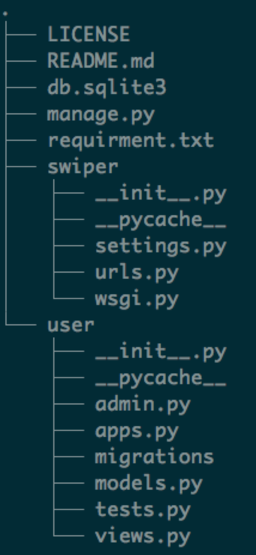
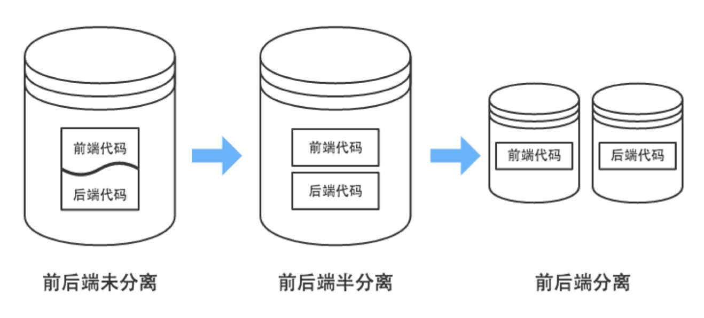
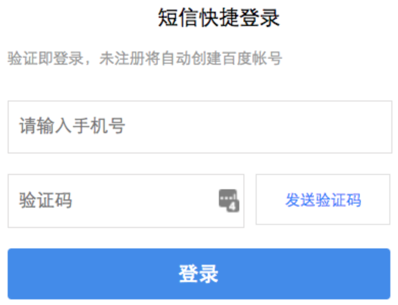

# 1.2 开始一个新的git项目、User 功能开发

## 真实项目代码布局

1. 概览：一个常规项目结构，Django 推荐布局

   ```sh
   proj_name/
   ├── proj_name/           # 项目目录
   │   ├── settings.py          # 项目配置
   │   ├── other_config.py      # 其他配置
   │   ├── urls.py              # 路由映射定义
   │   └── wsgi.py              # 网关接口
   ├── common/              # 不与具体模块关联的独立的东西写到这里
   │   ├── errors.py            # 错误码定义
   │   ├── keys.py              # 各种 key 定义
   │   └── middleware.py        # 中间件定义
   ├── app1/                # 应用1目录
   │   ├── migrations/          # 数据库迁移脚本，Django 自动维护
   │   ├── apps.py              # 应用定义
   │   ├── helper.py (logic.py) # 逻辑写到这里
   │   ├── models.py            # 数据模型定义
   │   ├── tests.py             # 测试脚本
   │   └── views.py (api.py)	   # 有页面标签用 views，纯数据用 api   
   ├── app2/                # 应用2目录
   │   ├── migrations/
   │   ├── apps.py
   │   ├── helper.py
   │   ├── models.py
   │   ├── tests.py             
   │   └── views.py (api.py)
   ├── lib/                 # common 用到的更底层的模块写到这里
   │   ├── cache.py             # 缓存封装
   │   ├── http.py              # HTTP请求封装
   │   ├── orm.py               # ORM: Object Relation Mapping 对象关系映射
   │   └── sms.py               # SMS: Short Message Service 短信
   ├── worker/              # 异步任务，或耗时任务，或定时任务
   │   ├── __init__.py          # 表明这是一个 python 模块
   │   └── config.py            # worker 配置
   ├── scripts/             # 独立执行的工作脚本
   │   ├── deploy.sh            # 部署脚本
   │   ├── upgrade.sh           # 升级脚本
   │   ├── db_backup.sh         # 数据备份脚本
   │   └── some_python.py       # 单独的任务脚本
   ├── db/                  # 所有与数据库有关的各种 SQL 脚本
   │   ├── some_sql.sql         # 
   │   └── query_report_1.sql   # 统计分析脚本
   └── manage.py
   ```

   - 布局缺点，每个 app 一个目录，随着项目变大，app 增多，目录越来越多，大项目可能多到几百个。

2. 布局不是死的，可以灵活自己调整：看另一个（一个真实的游戏项目目录结构）

   ```shell
   .
   ├── admin                # 管理后台
   │   ├── templates            # 后台模板
   │   ├── views                # 后台视图
   │   ├── __init__.py          # 后台初始化
   │   ├── admin_config.py      # 后台配置
   │   ├── auth.py              # 认证
   │   ├── decorators.py        # 装饰器
   │   ├── models.py            # 模型
   │   └── urls.py              # 路由映射
   ├── common               # common
   │   ├── context_processors
   │   ├── decorators
   │   ├── middlewares
   │   ├── templatetags
   │   ├── __init__.py
   │   ├── rkauth.py
   │   └── sequence.py
   ├── config               # 配置文件很多，独立一个目录管理
   │   ├── __init__.py
   │   ├── cache.conf
   │   ├── common_config.py
   │   ├── game_config.py
   │   ├── logic.conf
   │   ├── model.conf
   │   └── storage.conf
   ├── logics               # 逻辑层
   │   ├── handlers
   │   ├── __init__.py
   │   ├── friend.py
   │   ├── store.py
   │   └── user.py
   ├── models                # 模型层
   │   ├── __init__.py
   │   ├── account_mapping.py
   │   ├── config.py
   │   ├── ext_info.py
   │   ├── friend.py
   │   ├── game_info.py
   │   ├── notice.py
   │   ├── package.py
   │   ├── store.py
   │   └── user.py
   ├── platform              # 与接入平台有关的接入 api
   │   ├── __init__.py
   │   └── api.py
   ├── templates             # 模板
   │   ├── base.html
   │   └── index.html
   ├── views                 # 视图层
   │   ├── __init__.py
   │   └── main.py
   ├── __init__.py           
   ├── import_test.py
   ├── manage.py
   ├── settings.py           # django 配置
   └── urls.py               # 路由映射
   ```

   

3. 布局详解

   - 通用的算法、功能放到 common 目录
   - 底层的功能放到 lib 目录
   - 独立脚本的放到 scripts 目录
   - 配置文件放到项目目录 或 config 目录
   - views.py 及 view_func()
     1. MVC 模式的 V 只负责视图处理, 逻辑属于 Controller 层
     2. view_func 本身不适合写逻辑, view 是特殊函数, 只负责视图处理。
     3. 添加 helper.py 文件, 用来放置每个 app 的逻辑函数
     4. 函数构建应保持功能单一, 一个函数只做一件事情, 并把它做好, 避免构建复杂函数
     5. 复杂功能通过不同函数组合完成
   
4. 推荐阅读：

   1. 《代码大全2》《Code Complete2》基础程序员应该掌握的命名规范、写函数的最佳实践
   2. 改善Python程序的91个方法
   3. 松本行弘-程序世界：ruby语言的发明者
   4. 周爱民-我的架构思想：基本模型、理论与原则
   5. 架构简洁之道
   6. 温伯格《探索需求》《如何成为技术领导者》《程序开发心理学》《你的灯亮着吗？》
   7. 《人月神话》《人件poepleware》

5. 面试题：

   1. 你怎么组织你的代码？

## 项目设计阶段

- 项目不是一上来就开工的
- 需求分析：大家（需求发起人、产品、技术、测试、运营）先把需求商量清楚了，确保各自理解的**需求一致**
- 概要设计：由有经验的架构师或者技术 leader 带着先做好概要设计
  - 参看几个真实的项目中的设计文档：Vego、Light Circle 设计文档
  - 如果去了一家公司，什么设计文档都没有，全靠口头交流和看代码：
    - 先看看能否推动写文档
    - 如果不能，尽早做好其他打算。
  - **改变你能改变的，接受你不能改变的，有智慧分辨这两者。**-- 李开复
- 模块分工：按照项目模块，工作阶段要求，大家分好工
- 详细设计：具体自己负责的模块，在概要设计的基础上，做好**详细设计**
- 基础模块：
  - 缓存cache、
  - 数据库访问orm、
  - HTTP请求http、
  - 登录验证auth、存储storage这些基础模块，
  - 一般由有经验的架构师负责做好，其他人直接拿去用。
- 面试题：
  - 你写过设计文档么？怎么写的？都包含什么？你怎么与他人协作写设计文档？
  - google drive
  - 石墨、腾讯在线文档
- 如果有东西影响我们学习，影响我们挣钱？而且我们突破了也没什么坏处，影响不到他人？怎么办？想办法突破它？
  - 英语
  - 网络
  - **意志**

## 项目初始化

1. 在github上创建项目：
   1. 选择gitignore: python
   2. license: MIT / Apache 2.0
   3. 勾选创建 readme.md
2. clone下来：git clone ...
3. cd src
4. pyenv：管理python版本的，用来安装不同的python版本的
5. 创建虚拟环境：**python3 -m venv .venv**
   1. 或者用 virtualenv 管理: 
      1. 创建：pyenv virtualenv 3.6.4 env36
      2. 进入：pyenv activate env36
      3. 退出：pyenv deactivate env36
   2. 干脆不用虚拟环境也可以
   3. Pycharm管理或者anaconda管理都可以
6. 激活虚拟环境：
   1. Linux: source .venv/bin/activate
   2. Windows: .venv/Scripts/activate.bat
      1. 在Windows下的bash环境？？？
7. 安装软件包：pip install django==1.11.22 ...
8. 冻结pip列表：pip freeze > requirements.txt
9. 开启 django 新项目：django-admin startproject ...
10. 提交新代码

```shell
# 在github上创建项目：
#   1. 选择.gitignore: python
#   2. license: MIT / Apache 2.0 / GPL3
#   3. 勾选创建 readme.md / 是一个非常好的文档
git clone https://github.com/yuzebin/new0917.git # 克隆代码下来
cd new0917
python -m venv .venv                # 创建 Python 虚拟环境
source .venv/bin/activate           # 激活虚拟环境
# .venv/Scripts/activate.bat        # Windows 下的激活命令
# 安装软件包
pip install django==1.11.18 gunicorn gevent redis==2.10.6 celery ipython requests
pip freeze > requirment.txt         # 冻结环境，未来还原环境时使用
# pip install -r requirment.txt     # 还原环境方法
django-admin startproject your_prj_name ./ # 新建一个 Django 项目
# 将代码加入主干
git add .
git commit -m 'first commit'
git push                            # 推送到远端
# 创建一个新的工作分支
git branch user                     
git checkout user                   # 切换到新分支
django-admin startapp user          # 启动一个新的 Django 应用，此时django会创建一个user子目录
vi ./your_prj_name/settings.py      # 把 user 加入 INSTALLED_APPS
# 把新的代码加入到新的工作分支中
git add .
git commit -m "user first commit"
git push --set-upstream origin user # 把本地新建分支推送到远端
vi ./user/models.py                 # 增加字段，代码参考 2/2/user/models.py 文件
python manage.py makemigrations     # 生成迁移脚本文件
python manage.py migrate            # 执行迁移动作：真实生成数据库表
# 把model迁移代码加入git中
git add .
git commit -m "加入 user model 迁移代码"
git push # 把本地新建分支推送到远端
```

- 
- 面试题：
  - 如何开始一个新项目？

## 分支创建

1. develop 分支，组长负责创建
   1. git branch develop
   2. git checkout develop
   3. git add .
   4. git push --set-upstream origin develop
   5. git push
2. 其他人 pull，拉下来新分支
3. 各自模块的分支，各自创建
   1. 一个人负责模块，自己创建
   2. 两个人负责的模块，商量一下，由一个人来建，另一个人 pull 下来


##  任务

1. 组长
   1. 创建新分支 develop
   2. 创建 新django 项目
   3. 推送代码到远端仓库
2. 组员：
   1. pull新分支
   2. 查看远程分支：git branch -r
   3. 切换分支：git checkout develop

## "用户中心" 模块功能概览

1. 获取短信验证码：发短信
2. 通过验证码登录、注册：验证
3. 获取个人资料
4. 修改个人资料
5. 头像上传：上传头像


## User 模型及接口规划

1. User 模型设计 (**仅作参考**)

   | Field       | Description |
   | ----------- | ----------- |
   | phonenum    | 手机号      |
   | nickname    | 昵称        |
   | sex         | 性别        |
   | birth_year  | 出生年      |
   | birth_month | 出生月      |
   | birth_day   | 出生日      |
   | avatar      | 个人形象    |
   | location    | 居住城市    |

2. 接口规划

   - 接口1: 用户提交手机号，后台发送短信验证码
   - 接口2: 用户提交验证码，后台验证，成功则登录或注册


## 开发中的难点

1. 如何向前端返回 **json** 数据
2. 短信发送如何处理
3. 验证码如何处理
    - 验证码需**随机**产生，登录注册验证码一般为 4~6 位随机数
    - 第一个接口获取到的验证码在登录接口还需要使用，需如何**保存**
    - 每个验证码都有**有效期**，应如何处理：redis


## RESTful 与前后端分离

1. RESTful

    - RESTful 是一种网络软件架构风格, 而非**标准**，相当于是一个事实上的标准。

        - Representational State Transfer 表现层状态转化

    - 用 URL: uniform resource location 定位一个网络资源

    - URI:uniform resource identify

    - 对一个资源的操作：

        - | 动作 | HTTP Method | SQL         | CRUD   | R/W  |
            | ---- | ----------- | ----------- | ------ | ---- |
            | 增   | POST        | insert into | Create | W    |
            | 删   | DELETE      | delete      | Delete | W    |
            | 改   | PUT         | update      | Update | W    |
            | 查   | GET         | select      | Read   | R    |

    - 用 **HTTP 动词**描述对资源的操作
        - GET: 用来获取资源
        - POST: 用来新建资源：不是幂等，不能重放，不能重复执行
        - PUT: 用来更新资源：幂等，可以重放，可以重复执行
        - DELETE: 用来删除资源
        - 不遵循RESTful风格：
          - A团队：http://new.somedomain.com/api/edit/user?id=5&nickname=newnick
          - B团队：http://new.comedomain.com/api/user/update/5
        - 遵循RESTful风格：
          - PUT ：http://new.comedomain.com/api/user?id=5
          - DELETE：：http://new.comedomain.com/api/user?id=5
        - FORM
        
            - 只支持：GET、POST
        
    - 误区
        - URL 中使用动词
        - URL 中出现版本号
        
    - 参数用 querystring 表示, 而不要拼在 path 部分
        - 错误示范: GET /user/book/id/3
        - 正确示范: GET /user/book?id=3
        
    - 状态码的使用要精确，与HTTP协议保持一致
        - 2xx：操作成功
        - 3xx：重定向
        - 4xx：客户端错误
        - 5xx：服务器错误

    - RESTful 与 Django REST framework 的区别

2. HTTP协议：

    1. URL
        1. http://new.somedomain.com:8080/api/user?id=5&name=dddd#part
        2. 协议://域名:端口/路径?参数1&参数2#片段(锚点)
        
    2. Header：
        1. User-Agent：用户代理，描述客户端是什么设备类型
        2. Cookie：
        3. Refer：引用页
        4. Cache-Control：控制浏览器缓存
        5. Content-Length：本次发送的内容长度
        
    3. HTTP状态码：代表资源状态
        1. 100系列：继续
            1. 100:继续
            2. 101:切换协议
        2. 200系列：正常
            1. 200：ok
            2. 206: 部分完成
                1. 100,000,000Bytes
                2. 大文件分片下载，断点续传
        3. 300系列：重定向
            1. 301
            2. 302
            3. 307
        4. 400系列：客户端错误
            1. 403：(服务端有这个资源，但是客户端没有权限，所以)拒绝访问
            2. 404：(服务端没有错，)这个资源不存在
        5. 500系列：服务器错误
            1. 502: Bad Gateway     （NginX收到你的请求了，但是）没找到对应网关
            2. 503: Service Unavailable（NginX收到你的请求了，但是）后边的服务不可用
            3. 504: Gateway Timeout（NginX收到你的请求了，也发给后端服务了，但是）后边的服务超时了
            4. NginX -> Django
        
    4. GET / POST / DELETE / PUT
        1. GET可以重放，不影响状态
        2. GET的URL可以被bookmark
        3. GET 请求会被浏览器主动缓存, 而 POST 不会
        4. GET 请求参数会被完整保留在浏览器历史记录⾥
        5. GET 请求的数据只能进行 URL 编码, ⽽ POST ⽀持多种编码⽅式.
        6. GET 请求在 URL 中传送的参数是有长度限制的 (URL 的最⻓度取决于浏览器实现，IE 4k), 而 POST没有.
        7. GET 只接受 ASCII 字符, ⽽ POST 没有限制.
        8. GET 产⽣⼀个TCP数据包;POST产生两个TCP数据包.
            1. GET: 浏览器会把 http 的 header和data⼀并发送出去, 服务器响应200(返回数据);
            2. POST: 浏览器先发送 header, 服务器响应 100 continue, 浏览器再发送data, 服务器响应200 ok(返回数据).
        
    5. Cookie / Session：用来协助服务端追踪客户端状态

        1. Cookie 存储在客户端浏览器里
        2. Session 存在服务器端，但是把Session_id保存在客户端浏览器的Cookie里
        3. 登录的过程：
           1. 打开一个网站：www.baidu.com
           2. 点击登录，填写帐号密码，点击提交
              1. 后台服务器：
                 1. 拿到我们提交上去的用户名密码
                 2. 去用户数据库里比对此用户的密码
                    1. 如果一致，返回给客户端浏览器登录成功的信息，同时在服务器端把该用户的登录状态记录下来，存入Session中，同时把Session_id写入Cookie中，发还给客户端浏览器
              2. 客户端浏览器：
                 1. 收到登录成功的消息，还有Session_id，浏览器就把Session_id写入Cookie，保存下来。
        4. 用户又点击了个人资料页
           1. 浏览器：
              1. 向服务器上的个人资料页发起请求，同时带上事先存下来的Cookie，也就是把之前存下来的Session_id再发给服务器
           2. 服务器收到个人资料页的请求，同时也收到了Session_id
              1. 去比对这个Session_id和服务器事先存好的Session_id，
                 1. 如果找到一致的，说明这次请求是刚刚登录过的用户的，这是一次合法请求
                 2. 如果没找到，说明这次请求非法，或者Session_id过期了，会引导用户重新登录

    6. HTTPS
        1. 一般NginX负责HTTPS

           ```
           ......
           ssl on;
           ssl_certificate     /usr/local/openresty/nginx/conf/my_com.crt;
           ssl_certificate_key /usr/local/openresty/nginx/conf/my_com.key;
           ......
           ```

        2. 服务器内部不管

        3. HTTPS协议的细节

3. 前后端分离

    

    传统 Web 开发, view 函数中需要进行模版渲染, 逻辑处理与显示的样式均需要后端开发.

    变成前后端分离后, 显示效果的处理完全交给前端来做, 前端自由度变大. 后端只需要传递前端需要的数据即可, 将后端人员从繁琐的显示处理中解放出来, 专心处理业务逻辑

    - 优点: 前端负责显示, 后端负责逻辑, 分工更加明确, 彻底解放前、后端开发者

    - JSON: 完全独立于编程语言的文本格式, 用来存储和表示数据

    - 前后端分离后的开发流程

      
      
    -  **Mock 机制**：在真实对象可工作之前，让依赖它的程序去访问一个仿制的对象，让其他程序可以继续进行开发

        - 桩服务：stub
        - Mock test
        - Mock server
            - 仿制 api
            - 用 mock server
                - 就是返回一个写死的 json 文件，结构是要按照双方约定的接口标准来
        - Mock Object
            - 静态返回固定值的类
        - 仿制的
            - 当一个实体(api/ojbect)还没有创建成功的时候，做一个仿制的，供其他程序调用测试

4. 代码实现

    ```python
    from json import dumps
    
    from django.http import HttpResponse
    
    # 定义 render_json
    def render_json(data=None, error_code=0):
        '''将返回值渲染为 JSON 数据'''
        result = {
            'data': data,       # 返回给前端的数据
            'code': error_code  # 状态码 (status code)
        }
    
        # dumps 把一个dict 转换为 json 结构的字符串
        json_str = dumps(result, ensure_ascii=False, separators=[',', ':'])
        
        # 把这个 json 字符串返回给浏览器
        return HttpResponse(json_str)
    ```

5. 接口的定义

    1. 定义接口基本格式

       ```json
       {
           "code": 0,   // 错误码 (status code)
           "message": "",
           "data": {    // 接口数据
               "user": {
                   "uid": 123321,
                   "username": "Lion",
                   "age": 21,
                   "sex": "Male"
                },
               "date": "2018-09-12",
           }
       }
       ```

    2. 定义 status 状态码

        | code | description    |
        | ---- | -------------- |
        | 0    | 正常           |
        | 1000 | 服务器内部错误 |
        | 1001 | 参数错误       |
        | 1002 | 数据错误       |

    3. 详细定义每一个接口的各个部分:
        - 名称 (Name)
        - 描述 (Description)
        - 方法 (Method):GET/POST/PUT/DELETE
        - 路径 (Path)
        - 参数 (Params)
        - 返回值 (Returns)

    4. 接口定义举例：

        1. 获取验证码：
            1. 名称 (Name)：获取验证码
            2. 描述 (Description)：获取验证码
            3. 方法 (Method):POST
            4. 路径 (Path)：/submit/phonenum
            5. 参数 (Params)：phonenum 手机号
            6. 返回值 (Returns)
                1. {
                        "code": 0,
                        "message": "ok"
                    }
        2. 提交验证码登录
        
        > **接口名称：提交验证码登录**
        >
        > * **Description**: 根据上一步的结果提交需要的数据
        > * **Method**: POST
        > * **Path**: /user/login
        > * **Params**:
        >
        >    field | required | type | description
        >    ------|----------|------|-----------------------
        >    phone | Yes      |  int | 手机号
        >     code | Yes      |  int | 验证码
        >
        > * **Return**:
        >
        >    field     | required | type | description
        >    ----------|----------|------|-----------------------
        >     uid      |    Yes   | int  | 用户 id
        >     nickname |    Yes   | str  | 用户名
        >     age      |    Yes   | int  | 年龄
        >     sex      |    Yes   | str  | 性别
        >     location |    Yes   | str  | 常居地
        >     avatars  |    Yes   | list | 头像 URL 
        >
        >    示例:
        >    ```json
        >    {
        >        "code": 0,
        >        "data": {
        >            "uid": 123,                             // 用户 id
        >            "nickname": "Miao",                     // 用户名
        >            "age": 21,                              // 年龄
        >            "sex": "M",                             // 性别
        >            "location": "China/Beijing",            // 常居地
        >            "avatars": "http://xxx.com/icon/1.jpg"  // 头像
        >        },
        >    }
        >    ```


## 第三方短信平台的接入

1. 短信验证整体流程:
    1. 用户输入手机号，点击发送验证码
       1. 用户点击“发送验证码”时，浏览器就向服务器发送了一个请求（POST/GET），带上用户的手机号
       2. 此处需要一个服务端接口：
          1. 服务器收到了用户的手机号
          2. 服务器这时生成一个随机的验证码，同时要把这个验证码保存一下，方便以后比对
          3. 服务器调用短信平台接口, 将用户手机号和验证码发送到短信平台
    2. 短信平台向用户发送短信
    3. 用户收到了短信，填写进验证码输入框，再点登录
       1. 此时浏览器再向服务器发请求，此时带上手机号和验证码向服务器发请求
       2. 此处也需要一个服务端接口：
          1. 服务器收到手机号和验证码，与服务器自己保存的验证码比对
          2. 比对成功，验证通过，登录成功
             1. 如果该手机号没有注册过，自动注册一个新用户
2. 可选短信平台
    - 阿里云: <https://www.aliyun.com/product/sms>
    - 腾讯云: <https://cloud.tencent.com/document/product/382>
    - 网易云: <https://netease.im/sms>
    - **云之讯: <https://www.ucpaas.com/>**
    - 互亿无线: <http://www.ihuyi.com/>
3. 注册账号，验证成功后, 将平台分配的 APP_ID 和 APP_SECRET 添加到配置中
    - APP_ID: 平台分配的 ID
    - APP_SECRET: 与平台交互时, 用来做安全验证的一段加密用的文本, **不能泄漏给其他人**
4. 平台默认提供短信验证码模版：
1. 自己建容易被拒，平台审核严格，需要不断修改提交
5. 按照平台接口文档开发接口
   - 短信平台的接口通常是 HTTP 或 HTTPS 协议, 接入的时候只需按照接口格式发送 HTTP 请求即可
   - 接口的返回值一般为 json 格式，收到返回结果后需要解析
   - 如果有更苛刻的性能要求，或者，我们要统计分析短信发送成功的数据，还要统计收到短信后回到我们服务里的用户，问平台有没有数据接口，对账接口

## 接口实现：

1. 新建应用：

   1. ```shell
      # 在建好的django project的目录中，执行以下指令
      django-admin startapp user
      git add .
      git commit -m "add user app"
      git push
      ```

2. 修改views：mv views.py api.py

3. 修改models.py：
   1. 添加用户数据字段:
      1. 参考代码："1.2-开始一个新的git项目、User 功能开发/1.2-开始一个新的git项目、User 功能开发"目录
   2. 添加 age 属性
   3. 添加 to_dict 方法

4. 迁移数据结构：
   1. python manage.py makemigrations
   2. python manage.py migrate

5. 先写 api.py 文件：里面创建提交手机号的对应处理方法：submit_phone()

6. 修改urls.py 文件：增加一个路由，把提交手机号获取验证码的接口映射写上去

7. 修改django 的settings.py 文件：把user 加入INSTALLED_APP

8. 启动 Server 测试：python manage.py runserver 9876

9. 测试无误，就可以提交 Git：
   1. git add .
   2. git commit -m "first module user."
   3. git push


## 登录验证中间件

大多数接口都需要登陆后才可使用，可以通过中间件的方式统一验证。

要点:

1. 统一验证所有接口的登录情况，如果没有登录给出一些提示
2. 需要将不需要验证的特殊接口排除在外

## 开发中用到的工具

1. GUI
   1. IDE：PyCharm
   2. 数据库管理工具：Navicat / MySQL Workbench / PyCharm 自带的SQL管理工具
   3. 接口调试工具：Postman
   4. Redis客户端工具：Medis
2. 命令行工具：
   1. Git
   2. iPython
   3. Django Shell
3. 协作
   1. 协作写作的平台：石墨、QQ文档
   2. bug管理工具
   3. 原型图查看工具：Axure
4. 作业平台：
   1. 发布，要提交