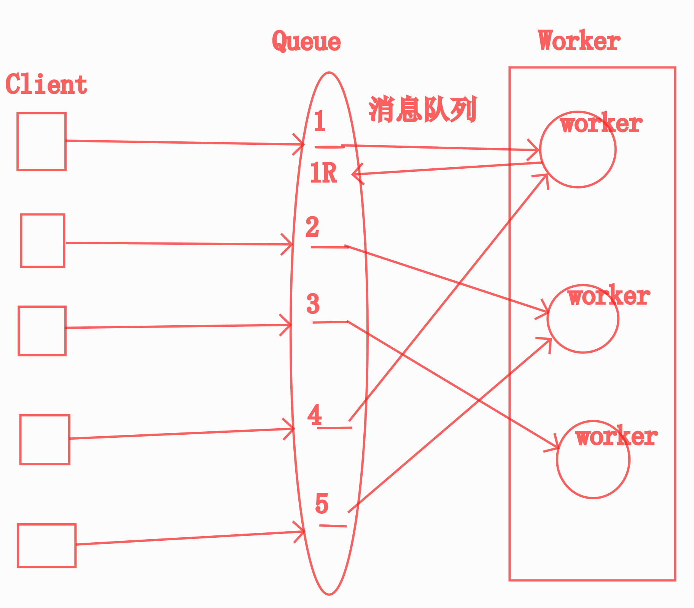

# 1.4 上传文件、异步、初始化脚本

## 项目中的静态文件处理

1. Nginx

   Nginx 处理静态资源速度非常快, 并且自身还带有缓存.

   但需要注意, 分布式部署的多台 Nginx 服务器上, 静态资源需要互相同步

   80: Nginx -> {server config} -> django:8080

   ​                                               -> Static : folders

   ​											   -> 云存储

   独立域名：static.baidu.com

   1. 过去：一个浏览器只能向同一个域名发起两个并发的连接
   2. 现在：一个浏览器向同一个域名能发起的并发请求4-10
   3. 提高网页端的加载速度，改进用户体验
   4. 图片域名会用很多个img0...img7
   5. 更深的一点：独立域名就可以省掉传cookie的成本了

2. 第三方的 CDN 服务：Content Delivery Network

   1. CDN 的全称是 Content Delivery Network, 即内容分发网络.
   2. 它依靠部署在各地的边缘服务器, 通过中心平台的负载均衡、内容分发、调度等功能模块, 使用户就近获取所需内容, 降低网络拥塞, 提高用户访问响应速度和命中率. CDN 的关键技术主要有内容存储和分发技术.
   3. 各种云服务都会提供CDN服务：阿里云
   4. 专用的CDN厂商：51CDN(网宿)、蓝汛
   5. 分发：
      1. 分发的时候，我们自己只需要发到自己的一台服务器上
      2. CDN服务商负责把这个资源分发到全网的各个节点
   6. 用户在访问时：
      1. 请求域名
         1. DNS内的CNAME服务：Change domain NAME
            1. www1.domain.com -> www2.domain.com
            2. 按**地理位置分配DNS**：
               1. ip库，城市分布：
                  1. html: CDN中心源分发节点->边缘节点
                  7. SZ的用户就向145.145.145.145发起请求
                  8. SH的用户就向234.234.234.234发起请求
                  9. BJ的用户就向123.123.123.123发起请求
                  10. 用户请求的服务器上没有这个图片，CND服务器上会配有**回源策略**
               2. ip：[0-255].[0-255].[2-255].[0-255]: 0:用来表示整个网络
                  3. 123.123.123.0代表一个C类子网
                  2. 123.123.0.0代表一个B类子网
                  3. 123.123.123.255，代表123.123.123.0这个网内的广播地址
         2. 根据地理位置返回离用户最近的 IP
         3. **GeoDNS**
            1. static.somedomain.com - > china - > u.v.w.x
            2. static.somedomain.com - > amarica - > a.b.c.d
            3. static.somedomain.com - > canada - > 1.2.3.4
         4. 分发
            1. 先把资源传到一个服务器上：此服务器称为**源服务器**
            2. 主动**分发**
               1. CDN 主动从源服务器上把资源 copy 到 其他服务器上（边缘服务器）
            3. **回源**请求
               1. 用户向 static.somedomain.com 发请求时
                  1. 命中 某个服务器
                  2. 该服务器有此文件，直接还给用户
                  3. 该服务器无此文件，此服务器向源服务器发请求，拿到文件后，再还给用户，缺点：第一个用户需要等。
                  4. **模拟第一个用户发一次请求，服务器上文件就有了**
      2. 用什么指标来分析和衡量一个CDN性能好坏呢？
         1. 命中数
         2. 回源比例
         3. 边缘节点的延迟
            1. 5G低延迟：10ms以内
            2. 4G延迟：50-100ms
         4. 边缘节点的流量
         5. 配置错误
      3. 用户请求自然是从离他最近的服务器下载

   

3. 云存储

   - 常见的云存储有：亚马逊 S3 服务、阿里云的 OSS 、华为云OBS、七牛云 等

4. 面试题：

   1. 你了解CDN吗？能讲讲原理么？

5. 如何更换CDN上的图片？改名大法

   ## 七牛云接入

   1. 注册七牛云账号
   2. 创建存储空间：Bucket -> 有独立的域名，可以访问
   3. 获取相关配置
      - AccessKey：从个人中心-密钥管理里获得
      - SecretKey：从个人中心-密钥管理里获得
      - Bucket_name：我们自己新建的存储空间的名字
      - Bucket_URL：建好的新存储空间的访问url
   4. 安装 qiniu SDK：`pip install qiniu`
   5. [根据接口文档进行接口封装](https://developer.qiniu.com/kodo/sdk/1242/python)
   6. 按照需要将上传、下载接口封装成异步任务
   7. 程序处理流程
      1. **服务端上传方式**
         1. **用户图片先上传到我们的服务器上**
         2. 然后，我们的程序再调用七牛云的api，将图片上传到七牛云
         3. 上传成功后，拼接 avatar 的图片 url 地址：
            1. 七牛云的Bucket_URL/filename，将 avatar 的图片 url 存入数据库
      2. 客户端上传
         1. 客户端图片直接上传到云服务
         2. 客户端将图片地址告诉服务端，服务端更新数据库
         3. 其实存在一个安全隐患

## 异步任务

- 同步：主线是顺序执行的，遇到中间有费时的操作的时候，主线会卡住，等待费时的任务完成，才能继续执行
  - 存钱，必须等数据都写好没问题了才返回
  - 游戏动作，必须按顺序完成的，Boss的最后一血，到底算谁砍的，算错了麻烦就大了
  
- 异步：主线仍然是顺序执行的，遇到中间有费时的操作的时候，就丢出一个分支去单独执行这些费时的操作，主线并不会等待，会快速继续往下执行，让费时的任务在后台慢慢操作，给用户更好的体验。
  - 发短信发邮件，单独开一个分支去发就好了，不需要用户等到结果
  - 上传视频，传完后要编码，这个不需要用户等，单独开分支去编码就可以了
  - 运行一个费时的报告，不需要用户等，可以在报告就绪的时候给用户发一个消息提醒
  - 网页加载：图片就是异步后加载的，图片下载完之前，先出一个占位符，没必要非等头部的图片都出来了才往下加载
  - 手机里边，商品列表的加载：异步加载后边的商品列表页
  
- 异步并没有加速任务，只是没有让用户进行不必要的等待而已，后台可以让很多服务器去执行异步任务。

- 对于异步任务的资源控制，一般来说主要就是两个地方：

  - 缓冲区有多大（Queue 长度）
  - 并发数有多大（workers 数量）

- 进程是资源的最小单位。线程是调度的最小单位。

  - 同一个进程内的线程共享除栈和寄存器外的所有数据。

  - 开发时，要小心进程内多线程数据的冲突，也要注意多进程数据间的隔离（需要特别使用进程间通信）。

  - 进程间内存隔离的例子

    ```
    from time import sleep
    from concurrent.futures import ProcessPoolExecutor, wait
    from multiprocessing import Manager, Queue
    from ctypes import c_int64
    
    
    def worker(i, normal_v, shared_v):
        normal_v += 1            # 因为进程间内存隔离，所以每个进程都会得到 1
        shared_v.value += 1      # 因为使用了共享内存，所以会分别得到 1 和 2
    
        print(f'worker[{i}] got normal_v {normal_v}, shared_v {shared_v.value}')
    
    
    def main():
        executor = ProcessPoolExecutor(max_workers=2)
        with Manager() as manager:
            lock = manager.Lock()
            shared_v = manager.Value(c_int64, 0, lock=lock)
            normal_v = 0
    
            workers = [executor.submit(worker, i, normal_v, shared_v) for i in range(2)]
            wait(workers)
            print('all done')
    
    
    main()
    ```

  - 如果你要使用多进程，那么在程序启动的时候就把进程池启动起来，然后需要任何资源都请在进程内自行创建使用。如果有数据需要共享，一定要显式的采用共享内存或 queue 的方式进行传递。

- 一个简单的做法是，启动程序后，分别创建一个进程池（进程数小于等于可用核数）、线程池和 ioloop，ioloop 负责调度一切的协程，遇到阻塞的调用时，I/O 型的扔进线程池，CPU 型的扔进进程池，这样代码逻辑简单，还能尽可能的利用机器性能。 一个简单的完整示例：

  ```python
  """
  ✗ python process_thread_coroutine.py
  
  [2019-08-11 09:09:37,670Z - INFO - kipp] - main running...
  [2019-08-11 09:09:37,671Z - INFO - kipp] - coroutine_main running...
  [2019-08-11 09:09:37,671Z - INFO - kipp] - io_blocking_task running...
  [2019-08-11 09:09:37,690Z - INFO - kipp] - coroutine_task running...
  [2019-08-11 09:09:37,691Z - INFO - kipp] - coroutine_error running...
  [2019-08-11 09:09:37,691Z - INFO - kipp] - coroutine_error end, cost 0.00s
  [2019-08-11 09:09:37,693Z - INFO - kipp] - cpu_blocking_task running...
  [2019-08-11 09:09:38,674Z - INFO - kipp] - io_blocking_task end, cost 1.00s
  [2019-08-11 09:09:38,695Z - INFO - kipp] - coroutine_task end, cost 1.00s
  [2019-08-11 09:09:39,580Z - INFO - kipp] - cpu_blocking_task end, cost 1.89s
  [2019-08-11 09:09:39,582Z - INFO - kipp] - coroutine_main got [None, AttributeError('yo'), None, None]
  [2019-08-11 09:09:39,582Z - INFO - kipp] - coroutine_main end, cost 1.91s
  [2019-08-11 09:09:39,582Z - INFO - kipp] - main end, cost 1.91s
  """
  
  
  from time import sleep, time
  from asyncio import get_event_loop, sleep as asleep, gather, ensure_future, iscoroutine
  from concurrent.futures import ProcessPoolExecutor, ThreadPoolExecutor, wait
  from functools import wraps
  
  from kipp.utils import get_logger
  
  
  logger = get_logger()
  
  
  N_FORK = 4
  N_THREADS = 10
  
  thread_executor = ThreadPoolExecutor(max_workers=N_THREADS)
  process_executor = ProcessPoolExecutor(max_workers=N_FORK)
  ioloop = get_event_loop()
  
  
  def timer(func):
      @wraps(func)
      def wrapper(*args, **kw):
          logger.info(f"{func.__name__} running...")
          start_at = time()
          try:
              r = func(*args, **kw)
          finally:
              logger.info(f"{func.__name__} end, cost {time() - start_at:.2f}s")
  
      return wrapper
  
  
  def async_timer(func):
      @wraps(func)
      async def wrapper(*args, **kw):
          logger.info(f"{func.__name__} running...")
          start_at = time()
          try:
              return await func(*args, **kw)
          finally:
              logger.info(f"{func.__name__} end, cost {time() - start_at:.2f}s")
  
      return wrapper
  
  
  @timer
  def io_blocking_task():
      """I/O 型阻塞调用"""
      sleep(1)
  
  
  @timer
  def cpu_blocking_task():
      """CPU 型阻塞调用"""
      for _ in range(1 << 26):
          pass
  
  
  @async_timer
  async def coroutine_task():
      """异步协程调用"""
      await asleep(1)
  
  
  @async_timer
  async def coroutine_error():
      """会抛出异常的协程调用"""
      raise AttributeError("yo")
  
  
  @async_timer
  async def coroutine_main():
      ioloop = get_event_loop()
      r = await gather(
          coroutine_task(),
          coroutine_error(),
          ioloop.run_in_executor(thread_executor, io_blocking_task),
          ioloop.run_in_executor(process_executor, cpu_blocking_task),
          return_exceptions=True,
      )
      logger.info(f"coroutine_main got {r}")
  
  
  @timer
  def main():
      get_event_loop().run_until_complete(coroutine_main())
  
  
  if __name__ == "__main__":
      main()
  
  ```

  

## Celery 及异步任务的处理

1. 通用的异步框架的原理

   

   - 任务模块 Task

     包含异步任务和定时任务. 其中, 异步任务通常在业务逻辑中被触发并发往任务队列, 而定时任务由 Celery Beat 进程周期性地将任务发往任务队列.

   - 消息中间件 Broker：代理

     Broker, 即为任务调度队列, 接收任务生产者发来的消息（即任务）, 将任务存入队列. Celery 本身不提供队列服务, 官方推荐使用 RabbitMQ 和 Redis 等.

   - 任务执行单元 Worker

     Worker 是执行任务的处理单元, 它实时监控消息队列, 获取队列中调度的任务, 并执行它.

   - 任务结果存储 Backend

     Backend 用于存储任务的执行结果, 以供查询. 同消息中间件一样, 存储也可使用 RabbitMQ, Redis 和 MongoDB 等.

2. 安装

   ```
   pip install 'celery[redis]'
   ```

3. 创建实例

   ```python
   # filename tasks.py
   import time
   from celery import Celery
   
   broker = 'redis://127.0.0.1:6379'
   backend = 'redis://127.0.0.1:6379/0'
   app = Celery('my_task', broker=broker, backend=backend)
   
   @app.task
   def add(x, y):
       time.sleep(5)     # 模拟耗时操作
       return x + y
   ```

4. **启动 Worker**

   ```
   celery worker -A tasks --loglevel=info
   ```

5. 调用任务

   ```python
   from tasks import add
   
   add.delay(2, 8)
   ```

6. 常规配置

   ```python
   broker_url = 'redis://127.0.0.1:6379/0'
   broker_pool_limit = 1000  # Borker 连接池, 默认是10
   
   timezone = 'Asia/Shanghai'
   accept_content = ['pickle', 'json']
   
   task_serializer = 'pickle'
   result_expires = 3600  # 任务过期时间
   
   result_backend = 'redis://127.0.0.1:6379/0'
   result_serializer = 'pickle'
   result_cache_max = 10000  # 任务结果最大缓存数量
   
   worker_redirect_stdouts_level = 'INFO'
   ```

## Celery 工作的流程

1. 一次性的配置工作

   1. 安装：pip install 'celery[redis]'
   2. 常规配置：
      1. ...

2. 创建实例

   1. worker.\_\_init\_\_.py

   2. ```python
      import os
      
      from celery import Celery
      
      from worker import config
      
      os.environ.setdefault("DJANGO_SETTINGS_MODULE", "swiper.settings")
      
      # 创建 celery 的实例
      celery_app = Celery('swiper')
      
      # 配置来自 worker.config
      celery_app.config_from_object(config)
      
      # 自动发现任务
      celery_app.autodiscover_tasks()
      ```

3. 给需要异步的方法，添加装饰器

   1. ```python
      from worker import celery_app
      
      # 给需要异步的方法，添加装饰器
      @celery_app.task
      def function_name():
      ```

4. 发布异步任务(并未真正执行)：

   1. function_name.delay(params)

5. 后台启动异步任务工作(真正的执行)：

   1. **celery worker -A worker --loglevel=info**
   
6. 面试题：

   1. Celery任务执行出错如何处理？
   
7. Python 3.7 里面 celery 报错问题解决：

   1. async名称更换了，如下

      ```
      [Rename `async` to `asynchronous` (async is a reserved keyword in Python 3.7) #4879](https://github.com/celery/celery/pull/4879)
      ```

      开发人员已经处理了这个issue，合并了master，但是还没有发布。

      快速的解决方案是通过github安装celery，命令如下：
      `pip install --upgrade https://github.com/celery/celery/tarball/master`

## Social 功能概述

1. 需求
    1. 交友模块
        - 获取推荐列表
        - 喜欢 / 超级喜欢 / 不喜欢
        - 反悔 (每天允许反悔 3 次)
        - 查看喜欢过我的人
    2. 好友模块
        - 查看好友列表
        - 查看好友信息


## 开发中的难点

1. 滑动需有大量用户，如何**初始化大量用户**以供测试？
2. 推荐算法
3. 如何从推荐列表中去除已经滑过的用户，还要去掉自己
4. 滑动操作，如何避免重复滑动同一人
5. 如果双方互相喜欢，需如何处理，帮双方建立好友关系
6. 好友关系如何记录，数据库表结构如何设计？
7. vip：反悔接口，业务里的付费功能：
    1. “反悔”都应该执行哪些操作
    2. 每日只允许“反悔” 3 次应如何处理
    3. 后期运营时，如何方便的修改反悔次数
8. 内部很深的逻辑错误如何比较方便的将错误码返回给最外层接口


## 关系分析

1. 滑动者与被滑动者
    - 一个人可以滑动很多人
    - 一个人可以被多人滑动
    - 结论: 同表之内构建起来的逻辑上的多对多关系，Swiper实际上是一个关系表
2. 用户与好友
    - 一个用户有多个好友
    - 一个用户也可以被多人加为好友
    - 结论: 同表之内构建起来的逻辑上的多对多关系, Friend 表实际上就是一个关系表
    - 进一步考虑：
      - 每两个人之间的关系，用一条数据来记录还是用两条数据来记录呢？
        - 什么时候用一条？
          - 默认时，一条就能表示清楚好友关系？
        - 什么时候用两条？
          - 如果好友关系是有方向性的呢？比如关注、粉丝、喜欢
3. 同一个表的不同业务的，不同的多对多关系，需要不同的表来保存，但是在更高维度上，有可能统一
4. 表间关系，一定一定要跟需求发起方讨论清楚，为什么**需求分析**如此重要。
5. MySQL, iOS/IOS（cisco系统）


## 模型设计参考

1. Swiped (划过的记录)

    | Field | Description     |
    | ----- | --------------- |
    | uid   | 用户自身 id     |
    | sid   | 被滑的陌生人 id |
    | mark  | 滑动类型        |
    | time  | 滑动的时间      |

2. Friend (匹配到的好友)

    | Field | Description |
    | ----- | ----------- |
    | uid1  | 好友 ID     |
    | uid2  | 好友 ID     |


## 类方法与静态方法

- `method`
- 通过**实例**调用
    - 可以引用类内部的 **任何属性和方法**
    
- `classmethod`

    - 无需实例化
    - 可以调用**类**属性和**类**方法
    - 无法取到普通的成员属性和方法

- `staticmethod`

    - 无需实例化
    - **无法**取到类内部的任何属性和方法, 完全独立的一个方法


## 利用 Q 对象进行复杂查询

```python
from django.db.models import Q

# AND
Model.objects.filter(Q(x=1) & Q(y=2))

# OR
Model.objects.filter(Q(x=1) | Q(y=2))

# NOT
Model.objects.filter(~Q(name='kitty'))
```

## 1.5代码：

1. python manage.py makemigerations

2. python manage.py migerate

3. ./scripts/init.py

4. django shell，用django shell调试

5. ```python
   # python manage.py shell
   from lib.http import render_json
   from social import logics
   from social.models import Swiped
   import datetime
   
   from django.core.cache import cache
   
   from swiper import config
   from common import errors
   from user.models import User
   from social.models import Swiped
   from social.models import Friend
   
   userid = 2218
   swiped = Swiped.objects.filter(uid=userid).only('sid')
   swiped_uid_list = [sw.sid for sw in swiped]
   swiped_uid_list.append(userid)
   
   user = User.objects.get(id=uid)
   # 出错了
   
   users = User.objects.filter(
           location=user.profile.location,
           sex=user.profile.dating_sex,
           birth_year__range=[1984, 1999]
       ).exclude(id__in=swiped_uid_list)[:20]
users
   ```

   ## 编程范式：
   
 	1. 结构化编程
      	
      	
      	
      	
      	
      	   	1. 顺序思维
      	      	2. 代码 + 数据结构
      
   	2. 面向对象编程：OOP
          	
          	
          
          
          
          1. 对象思维
          
   	3. 函数式编程：lamda表达式
          	
          	 
          	 
          	 
          	 
          	   1. map() reduce() filter()
          	            1. 大数据里边map reduce
          	2. 数学思维

