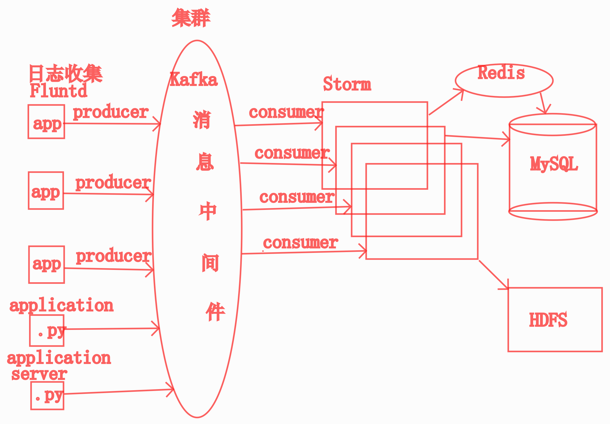
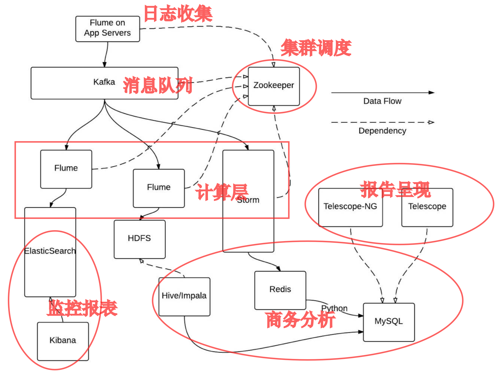

# 2.1 会员、权限、日志


## VIP、权限模块功能

1. VIP 分类
    - 非会员
    - 一级会员
    - 二级会员
    - 三级会员

2. 权限分类
    - 超级喜欢
    - 每日反悔 3 次
    - 查看喜欢过我的人

3. 权限分配
    - 非会员: 无任何权限
    - 一级会员: 超级喜欢
    - 二级会员: 超级喜欢 + 反悔3次
    - 三级会员: 超级喜欢 + 反悔3次 + 查看喜欢过我的人


## 开发难点

1. User 与 VIP 的关系

   - 一种 VIP 对应多个 User
   - 一个 User 只会有一种 VIP
   - 结论: **一对多关系**

2. VIP 与权限 的关系
   - 一种 VIP 级别对应多种权限
   - 一个权限会属于在多种级别的 VIP
   - 结论: **多对多关系**

3. 如何针对每个接口进行相应的权限检查 ?


## 模型设计

1. VIP (会员)

    | Field | Description |
    | ----- | ----------- |
    | name  | 会员名称    |
    | level | 等级        |
    | price | 价格        |

2. Permission (权限)
    | Field       | Description |
    | ----------- | ----------- |
    | name        | 权限名称    |
    | description | 权限说明    |


## 日志相关功能

1. 日志：使用系统的文件存储，换一个角度看，就是一种存储，跟数据库地位是平级的
2. 开发统计函数，将每日登录数据统计到日志
    - 登录时间
    - 登录者的 uid
3. 使用 Linux 命令统计出每天的 DAU (日活跃)：Daily Active User
4. 回过头在看
5. 游戏

    1. DNU：拉新
    2. DAU：留存、活跃
    3. MAU：留存、活跃
    4. ARPU：**Average Revenue Per User**：付费
        1. 总收入/所有用户
    5. ARPPU：Average Revenue Per Paying User：付费
        1. 总收入/所有付费用户
6. 电商业务
    1. 访客：web服务器日志
    2. 每日订单数：付费
    3. RFM
        1. 最近一次消费 (Recency)
        2. 消费频率 (Frequency)
        3. 消费金额 (Monetary)


    ## 日志处理

5. 日志的作用

   1. 记录程序运行状态
      1. 线上环境所有程序以 deamon 形式运行在后台, 无法使用 print 输出程序状态
      2. 线上程序无人值守全天候运行, 需要有一种能持续记录程序运行状态的机制, 以便遇到问题后分析处理
   2. 记录统计数据
      1. 用日志记录统计数据
      2. 接入的第三方的统计服务，很多都是用日志方式记录数据的
      3. 高并发行为，每秒钟几万次记录
   3. 文件的读写：R/W
      1. 随机读：性能较低
         1. SQL SELECT 读
      2. 随机写：性能很低
         1. SQL Insert / UPDATE
      3. 顺序读：性能很高
         1. 大的视频文件
      4. 顺序写：性能较高
         1. 日志：web server 配置即可
   4. 流式的数据
      1. 批式的数据：批式计算
         1. Hadoop 批处理
         2. Spark：微批处理
      2. 流式的数据处理系统：流式计算
         1. Storm
         2. Kafka
         3. Flink
   5. 开发时进行 Debug (调试)
   6. **分布式的基石**，就是日志
   7. 数据库，多服务器之间的复制，也是靠日志：
      1. MySQL: 主从复制依赖于binlog
      2. Oracle: 重做日志 redolog

6. 基本用法

   ```python
   import logging
   
   # 设置日志格式
   fmt = '%(asctime)s %(levelname)7.7s %(funcName)s: %(message)s'
   formatter = logging.Formatter(fmt, datefmt="%Y-%m-%d %H:%M:%S")
   
   # 设置 handler
   handler = logging.handlers.TimedRotatingFileHandler('myapp.log', when='D', backupCount=30)
   handler.setFormatter(formatter)
   
   # 定义 logger 对象
   logger = logging.getLogger("MyApp")
   logger.addHandler(handler)
   logger.setLevel(logging.INFO)
   ```

7. 日志的等级

   - DEBUG: 调试信息
   - INFO: 普通信息
   - WARNING: 警告
   - ERROR: 错误
   - FATAL: 致命错误

8. 对应函数

   - `logger.debug(msg)`
   - `logger.info(msg)`
   - `logger.warning(msg)`
   - `logger.error(msg)`
   - `logger.fatal(msg)`

9. 日志格式允许的字段

   - `%(name)s` : Logger 的名字
   - `%(levelno)s` : 数字形式的日志级别
   - `%(levelname)s` : 文本形式的日志级别
   - `%(pathname)s` : 调用日志输出函数的模块的完整路径名, 可能没有
   - `%(filename)s` : 调用日志输出函数的模块的文件名
   - `%(module)s` : 调用日志输出函数的模块名
   - `%(funcName)s` : 调用日志输出函数的函数名
   - `%(lineno)d` : 调用日志输出函数的语句所在的代码行
   - `%(created)f` : 当前时间, 用 UNIX 标准的表示时间的浮点数表示
   - `%(relativeCreated)d` : 输出日志信息时的, 自 Logger 创建以来的毫秒数
   - `%(asctime)s` : 字符串形式的当前时间。默认格式是“2003-07-08 16:49:45,896”。逗号后面的是毫秒
   - `%(thread)d` : 线程 ID。可能没有
   - `%(threadName)s` : 线程名。可能没有
   - `%(process)d` : 进程 ID。可能没有
   - `%(message)s` : 用户输出的消息

10. Django 中的日志配置

   ```python
   LOGGING = {
       'version': 1,
       'disable_existing_loggers': True,
       # 格式配置
       'formatters': {
           'simple': {
               'format': '%(asctime)s %(module)s.%(funcName)s: %(message)s',
               'datefmt': '%Y-%m-%d %H:%M:%S',
           },
           'verbose': {
               'format': ('%(asctime)s %(levelname)s [%(process)d-%(threadName)s] '
                       '%(module)s.%(funcName)s line %(lineno)d: %(message)s'),
               'datefmt': '%Y-%m-%d %H:%M:%S',
           }
       },
       # Handler 配置
       'handlers': {
           'console': {
               'class': 'logging.StreamHandler',
               'level': 'DEBUG' if DEBUG else 'WARNING'
           },
           'info': {
               'class': 'logging.handlers.TimedRotatingFileHandler',
               #'filename': f'{BASE_DIR}/logs/info.log',  # 日志保存路径
               'filename': os.path.join({BASE_DIR},'logs/info.log'),  # 日志保存路径
               'when': 'D',        # 每天切割日志
               'backupCount': 30,  # 日志保留 30 天
               'formatter': 'simple',
               'level': 'INFO',
           },
           'error': {
               'class': 'logging.handlers.TimedRotatingFileHandler',
               'filename': f'{BASE_DIR}/logs/error.log',  # 日志保存路径
               'when': 'W0',      # 每周一切割日志
               'backupCount': 4,  # 日志保留 4 周
               'formatter': 'verbose',
               'level': 'WARNING',
           }
       },
       # Logger 配置
       'loggers': {
           'django': {
               'handlers': ['console'],
           },
           'inf': {
               'handlers': ['info'],
               'propagate': True,
               'level': 'INFO',
           },
           'err': {
               'handlers': ['error'],
               'propagate': True,
               'level': 'WARNING',
           }
       }
   }
   ```

- 面试题：
  - 如何处理海量日志？

## 数据分析的日志流程

1. Nginx Webserver 日志

   ```
   1.2.3.4 - frank [10/Oct/2000:13:55:36 -0700] "GET /uid_123/explorer/item_12345 HTTP/1.0" 200 2326
   1.2.3.4 - frank [10/Oct/2000:13:55:36 -0700] "GET /uid_456/explorer/item_1245 HTTP/1.0" 200 2326
   1.2.3.4 - frank [10/Oct/2000:13:55:36 -0700] "GET /uid_789/explorer/item_345 HTTP/1.0" 200 2326
   1.2.3.4 - frank [10/Oct/2000:13:55:36 -0700] "GET /uid_135/explorer/item_1234 HTTP/1.0" 200 2326
   1.2.3.4 - frank [10/Oct/2000:13:55:36 -0700] "GET /uid_246/explorer/item_1235 HTTP/1.0" 200 2326
   1.2.3.4 - frank [10/Oct/2000:13:55:36 -0700] "GET /uid_147/explorer/item_128345 HTTP/1.0" 200 2326
   ```

2. 日志收集代理：Agent：syslog_ng / FluntD，将每条日志发送给集中的日志处理中心

3. Kafka，并发轻松上10万

4. 对接，其他的数据处理服务，取走数据做自己对应的业务数据分析，分析的结果入分析数据库

5. 几台服务器：几十万几百万规模的系统

   1. 日志收集

      1. 文件同步

         1. 定时 scp 到某一台日志处理服务器
         2. rsync 服务同步
         3. 也可以写 python程序远程复制

      2. unix编程思维

         1. 一个工具只完成单一的职能
         2. python写一个定时脚本
            1. 引入完整的定时框架，自己调度任务
               1. 这样代码比较复杂
            2. 这个脚本只完成每次调用要干的事儿，它自己不负责调度的事儿，把调度的工作拆出去
               1. crontab调用上述脚本
         3. Django 不擅长处理静态文件，干脆不干这个事儿

      3. 日志处理服务器上，有脚本定时分析日志文件，生成报告入库

         1. 定时方案：
            1. 借助于操作系统：crontab
            2. 借助于外部的框架
               1. celery-beat
               2. APSchedule

      4. DAU：（是否包含访客）

         1. 日志文件都是按小时分割的

         2. 日志按日分割

            1. 每天过了晚上11点，系统就出问题了
            2. 日志文件超过2GB

         3. cat 昨日访问日志 | awk '{print $1}' | sort | uniq | wc -l 得出昨日DAU，写入库里

         4. 每小时执行一次：

            1. cat 本日所有日志 | awk '{print $1}' | sort | uniq | wc -l 得出本日DAU，写入库里

            2. 一天24小时，就有24个本日DAU数据(每小时一个)

            3. 就可以出一个每日DAU的同比数据

            4. | 时间       | 1    | ...  | 8    | 9    | 10   |
               | ---------- | ---- | ---- | ---- | ---- | ---- |
               | 2019-08-26 | 30   | 35   | 3000 | 4000 | 4500 |
               | 2019-08-27 | 28   | 37   | 2800 | 3500 | 4200 |
               |            |      |      |      |      |      |

            5. 

      5. MAU

         1. 把当月的所有日志汇总遍历去重
         2. cat 当月日志文件集 | awk '{print $1}' | sort | uniq | wc -l 得出当月MAU，写入库里

      6. 登录用户占比

         1. cat 昨日访问日志 | grep 登录成功 | sort | uniq | wc -l 得出昨日登录用户数

      7. 有了DAU

         1. 有了登录用户数，如果我们业务约定的登录用户占比=登录用户数/DAU
         
      8. 点击未购买

         1. 

   2. 数据分析，分库，建一个从库，把主库复制过来，在从库上做各种复杂分析工作

6. 每日千万级

7. ```shell
     1. Log    .   2. Message   . 3. Streaming    .    4. Storage  
   Collection  .      Queue     .    Caculation   .       Layer   
     Layer 50  .      Layer 3-5 .    Layer(py) 3-5.              
               .   日志中间件     .                 .              
   +-------+   .    +-------+   .    +--------+   .    +-------+---> Monitor 
   |Fluentd+------->|Kafka 1+------->| Storm  +------->| MySQL +---> Analytics 
   +-------+   .    +-------+   .  +-+--------+   .    +-------+---> BI 系统
    syslog_ng  .      ...       .  |      ^       .              
    tee        .    +-------+   .  |      |       .              
    flume      .    |Kafka n+   .  | +----+----+  .              
    nc         .    +-------+   .  | |Zookeeper|  .              
    Log Agent  .                .  | +---------+  .              
               .  容忍极小的丢失  .  |              .              
               .                .  |              .                     类SQL
               .                .  |              .    +--------+     +-------+            
               .                .  +------------------>|  HDFS  +---->| Hive  |           
               .                .                 .    +--------+     +-------+
   ```

   

8. 唯品会


- 面向数据处理工程师：
  - 讲讲你理解的日志处理流程
  - Kafka的工作原理