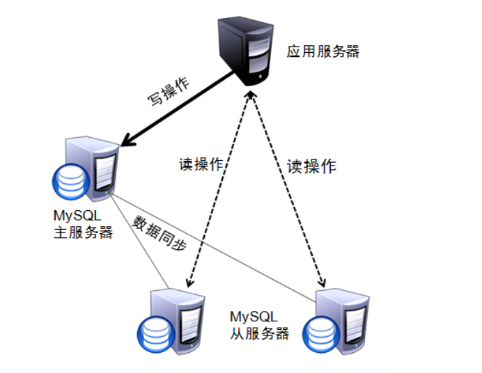
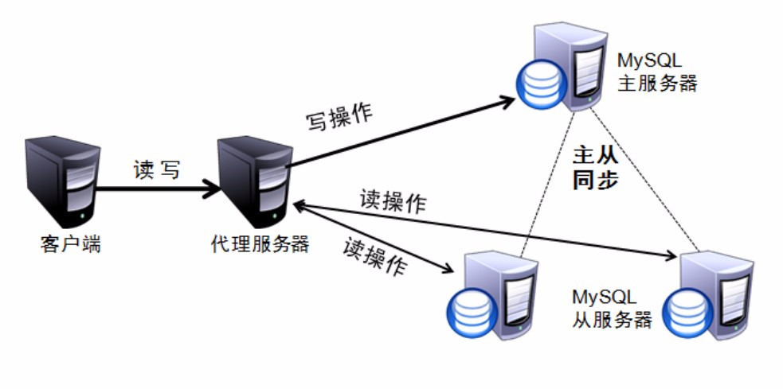
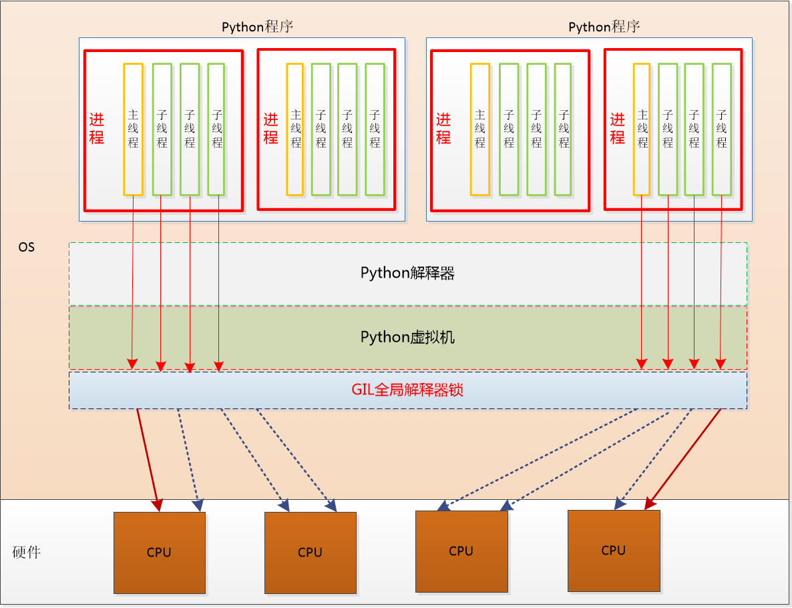

# 2.3 分布式存储及 Web 服务器性能

- 面试官如何面试
  - 基础能力：
    - 算法和数据结构
    - 逻辑题
  - 学习能力：
    - 看你说你会的东西，理解到什么程度
    - 对一个你关注的领域，有没有能跟踪最新的进展，这展现一个人的兴趣，愿不愿意钻研
    - 你关注什么社区和论坛：github、stackoverflow
      - 你用什么搜索：
    - 尽力让自己表现的专业：先以专业程序员的条件要求自己
      - 用机械键盘
  - 软能力：沟通，理解、逻辑思维
- 技术通用基础：
  - 算法：
  - 网络：HTTP
- **后端知识体系**
  - 语言：语法 20% python基础
  - 语言生态：库、框架 20% Django / Flask
  - 服务器：Linux 15% NginX
  - 网络：15% HTTP 、NginX
  - 存储：
    - File 10% 日志
    - 数据库 20% SQL
- 数据分析
  - **知识**：主要是指你对machine learning相关知识和理论的储备
  - **工具**：将你的machine learning知识应用于实际业务的工具
  - **逻辑**：你的举一反三的能力，解决问题的条理性，发散思维的能力，你的聪明程度
  - **业务**：深入理解所在行业的商业模式，从业务中发现motivation并进而改进模型算法的能力

## **高可用**与**负载均衡**

- Scale UP(不增加硬件个数，通过提升单个硬件的性能来提升整体性能)
- Scale OUT(不提升单个硬件的性能，通过增加硬件个数来提升整体性能)
- 单点故障：
  - 一个服务架构里面，有很多服务，如果某个服务只有一个可工作的节点，一旦这个节点发生问题，就完全无法提供服务，这样的故障称为单点故障。
- 冗余：解决单点故障的方法，从根本上来说，就是冗余，用多余的硬件换来稳定。
  - 好处：当工作的某个服务有问题的时候，我们有一个冗余备用的，可以顶上去工作，
  - 缺点：是成本上升，维护复杂。
  - 部件一级的
    - 电源：双路
    - 磁盘的冗余
      - RAID 0 :一份数据分两部分，写到两个磁盘上，每个磁盘都只有一部分数据，由于分成两半同时写，所以性能比单独写一块磁盘提高一倍，不能容忍任何磁盘损坏，故障容忍率0；
      - RAID 1：一份数据在两个磁盘上各写一份，每个磁盘上都有完整数据，因此写性能没有提升，可以容忍损坏一块磁盘，故障容忍率1/2。
      - RAID 5：n块盘，一份数据拆成n-1份分散写到每个磁盘上，同时把校验数据写入1块磁盘，性能提升1-1/(n-1)，5块盘，性能提升：1-1/4，可以容忍损坏一块盘，故障容忍率1/n
      - RAID 1+0：RAID 1 + RAID 0
  - 服务器一级的
    - 高可用：读写分离：MySQL M/S
    - 负载均衡：NginX
- 故障迁移：
  - 当一个服务器发生故障，无法对外提供服务时，由专门的检测程序监测到异常，把它原本负担的工作，转交由其他服务器处理，这个过程称为故障迁移，或者故障转移
  - 如何解决Redis的单点故障？
    - 最笨的方法：在程序里轮询
    - 复杂一点的：用redis的proxy方案：codis
- **高可用**：HA：High Available
  - 可以慢，不能错
  - 什么时候这个服务都要能工作，**任何一次请求不允许出错**，不允许出现单点故障
  - 用冗余来对抗故障
  - **数据库强调高可用**
  - 高可用不关注性能提升，最关注服务和数据的可靠性
- **负载均衡**：LB：Load Balance
  - 可以小错，不能慢
  - 访问量上来了，要能分配好，总体上保证服务可用
  - 如果某个服务器坏了，在故障迁移的过程中，可能暂时的有一小部分请求受影响，无法工作，能够接受
  - **Web server 和 App[lication] server(py,java,php) 强调负载均衡**
- 数据库热备份：备份时数据库不停止工作
  - 一个服务器工作时，旁边有一个相同配置的服务器 Stand by，不断与主服务器同步，随时待命，一旦主服务器发生故障，立即切换顶上去工作
  - 缺点：浪费一半硬件资源
- 冷备份：备份时数据库要停止工作
  - 有一个完整的时间点的备份

## 压力测试

- 计算：
  - 费米预测、费米估算：我们如何将问题分解。究竟哪些真实存在的因素导致了这样的事情发生？或者说，什么样的信息能够让我回答这个问题？
    - 预测纽约需要多少调琴师
      - 纽约钢琴调音师的数量取决于给钢琴调音的工作量和雇佣一位调音师可以做的工作，具体分解为下面4个数据：
        - 纽约的钢琴数量；
          - 纽约人口；
          - 拥有钢琴的人所占比例；
          - 学校、音乐厅、酒吧，有多少机构配置了钢琴？
        - 每年给钢琴调音的次数；
        - 给钢琴调音需要的时间；
        - 钢琴调音师每年平均工作时间
    - 预测北京四环内有多少干洗店
      1. 查有多少小区、每个小区多少人、平均多少人需要干洗店
      2. 北京干洗机销售数据、一台干洗机的平均寿命，一个干洗店平均几个机器（采样估算）
         1. 干洗液的销量
      3. O2O，干洗店都上网了，上网爬数据统计
      4. 调查行业数据，去干洗行业管理部门找数据
      5. 拿城市对比来看
    - 合理的预估偏差不会超过一个数量级
  - 服务器并发计算
    - 10万活跃用户：1-10之间
    - 平均每人每天活动100下
    - 假定每个活动产生3次数据库访问
      - R/W ：大多数用户是看，还是写
    - 单日的数据库访问 = 100000 * 100 * 3 = 30000000 次
    - 10小时预估：虽然一天有24小时，我们假定这些请求都是在白天10个小时的高峰时段内产生
      - 30000000 / 10 / 3600 = 833.33
      - 单服务器：
        - MySQL 硬件一般的，并发可以做到500
        - 现在MySQL硬件性能好，并发可以做到3000-5000
    - 80/20原则，80%的请求产生于20%的时间内
      - 30000000 * 0.8 / 4.8 / 3600 = 1388.89
    - 假设我们数据性能不好，400
      - 那我们知道，我们至少要3-4台服务器，才能支撑起数据库
      - 数据库分拆的时候，要看读写比例
      - 单 Master 结构：一台负责写，其他负责读
- 常用工具
  - [ab (apache benchmark)](https://httpd.apache.org/docs/2.4/programs/ab.html)
    - Ubuntu 下安装 ab: `apt-get install apache2-utils`
    - 压测: `ab -k -n 1000 -c 300 http://127.0.0.1:9000/`
  - [wrk](https://github.com/wg/wrk)
    - wrk -t2 -c20 -d5s http://www.baidu.com
  - locust: https://locust.io/
- Web 系统性能关键指标: 
  - 并发连接数
    - web 接入层的并发请求数：大于application层，运维管理
    - application(py, java, php)层的并发请求数，用户的行为动作
      - 应用层的高并发？怎么做？
        - 与Web和应用程序相关的，都可以往负载均衡上靠
    - 数据库层(MySQL,PgSQL)的并发请求数
      - 数据层高并发怎么做：
        - 高可用
      - **QPS (每秒查询数): Query per second:**
        - QPS :200-1000
      - 配置很好的，性能优良的数据服务器QPS: 1000-3000
        - QPS: 5000
        - TPS (每秒事务数, 数据库指标): Transaction per second
  - RPS (Requests per second)
- 面试题：
  - 如何做压力测试？
  - 如何处理高并发问题

## 性能优化思路

1. 分析业务，找出瓶颈
   1. 分析日志，找出耗时的api或者操作
   2. 检查服务器状态，发现资源瓶颈
      1. CPU
      2. 内存
      3. 磁盘IO
      4. 网络IO
   3. top
   4. sar 记录一段服务器状态历史：sar 5 5
   5. 现代化方案：监控系统：zabbix

## MySQL 的性能升级

- 搞清楚业务的类型，业务的读写比例：
  
  - CRUD：RW
    - 游戏：R: W = 1: 4
    - 社区：R: W = 1: 1
    - 电商：R: W = 4: 1
  - 读密集：加**读缓存**，用 NoSQL (Redis)做 Cache
    - 缓存：cache
      - memcache和reids区别
        - memcache纯内存，没有写盘的工作，设有缓存大小，超过大小，key就会丢失，memcache是一种比redis更易失的不可靠缓存
        - redis主要用内存，内存不够会写盘，性能会急剧下降
    - 社区
    - 广告
    - 视频
    - 浏览商品：读密集
  - 写密集：
    - 加**写缓冲**，在真正写库之前，先写到一个高速的中间层，然后再合并写入数据库
      - 缓冲：buffer
      - TokyoCabinet
      - 12次加积分的动作写入一个高速中间层，然后合并写入数据库
    - 或者分表分库
    - 电商：
      - 下单：写密集
    - 游戏：操作多，全记录，写密集
      - 偷菜：500万DAU
      - 单用户操作200
      - 单日10亿次写入的应用
  - 读写均衡：
    - 论坛
    - 微博
  
- 把观察问题的视角上升到整个系统架构上
  
  - 搞清楚问题是不是在 MySQL 上
  - 表现在 MySQL 上，问题不一定在 MySQL 上
  - MySQL 并发连接数超高
    - 可能是程序没有正确使用**连接池**
  
- 日志

  - web 服务器
  - 应用服务器
  - 缓存层
  - 数据库
  - 我们一个完整的请求
    - 前端：如何优化，提高图片加载，如何用上CDN
    - DNS：
    - 网络链路：
    - Web 服务器：Nginx日志，可以打开upstream响应时间
    - App 服务器 ： Application server，记录日志，记录每个请求的处理时间
      - 找出响应慢的接口
    - 缓存：
    - 数据库

- 确认瓶颈在SQL， MySQL 本身，针对 MySQL 如何解决性能问题

  - **第一步：单机优化**：不加机器的情况下，我们能做什么工作？

    - 80% : 分析优化 SQL语句，
        - 利用MySQL的慢查询日志，打开慢查询监控参数
        - 事后拿这些语句去分析
    - 索引优化：
        - 建好索引，根据我们where条件去建
        - 索引的原理，数据结构是B+/B*树
    - 优化表设计，调整结构，
      - 增加冗余的字段，节约计算
      - 大表拆小表
        - 把可变的数据与不变的分开
        - 尽量保持小表设计
    - 修改 my.cnf 配置，修改表和排序的缓存值
        - innodb_buffer_pool_size
    - 更换更高效的存储引擎：MyISM -> InnoDB -> XtraDB / PerconaDB: 5%-10%
    - **更换系统malloc的库，提升性能**
        - zlib
        - **Jemalloc**
        - **google**：tcmalloc
    - 硬件投入能马上解决的，升级内存，升级存储，先硬件投入，见效最快
  
  - 水平拆分：Sharding，数据库分片，数据库拆分
    - 按某个规则把数据分散放到结构相同，但名字不同的表中
    - 规则
      - hash：数据要求尽量均匀
        - 用户：User_00..User_ff
      - range：
        - 懒惰的分发
        - 1-100000
        - 100001- 200000
      - datetime：最近使用效率最高
        - 订单
      - geo_location：数据天生有地理分布特性
      - category：根据业务特点，按品类拆分
    
    - 分析优化对 MySQL 的程序访问连接
    
  - 通过增加冗余的数据库服务器可构建数据库集群 
  
  - 某些场景下，数据库集群：
  
      - 同一集群中的多台数据库保存的数据必须完全一致：主从结构
      - 集群中一台服务器宕机，其他服务器可以继续提供服务
      - 常见结构：
          - 一主多从，主从之间通过 binlog 进行数据同步
          - 双主多从：
              - **3M架构：Master-Master replication manager for Mysql**
  
- 单机优化无法解决问题了：
  
  - 一，把压力从MySQL挪出去
    - file：本地访问快，其他机器无法访问，不怕重启
    - mem：本地访问最快，其他机器无法访问，怕重启
    - NoSQL：网络访问，没有本地快，但是任何机器都可以访问，不怕重启（加了**持久化**支持后）加读缓存Redis，把读的压力从MySQL分拆出去
  - 二，增加MySQL的处理能力
      - 读写分离
      - 数据库Sharding
      - 双主结构：3M架构
      - 数据库集群
  
- 读写分离：把Read 和 Write操作分开
  
  - 主机用来做数据写入
    
  - 从机用来数据读取
  
- 主服务器与从服务器之间的同步由MySQL自己负责：binlog
  
  - 程序自身实现读写分离
    
  
  
  
    - 使用第三方代理工具实现读写分离
      - mysql_proxy
      - Atlas:360
      - Amoeba:alibaba
      - *sohu*
        - netease
  
  
  
  - **数据库 Sharding** / 分库分表 / 数据库分片：**重点介绍**
  
  - **分布式数据库**
    
  - 云数据库：新兴方式
  
- 面试题：

  - 数据库的优化方法

## 数据库 Sharding / 分库分表 / 数据分片

1. 数据分片
    * 单表查询能力上限: 对 MySQL 来说，约为 500 万 左右，设计优良的小表(字段很少) 1000万 也是上限了
    * B+树存储方式的存储上限：单表2000条
* 方式: 分库、分表
  
2. 垂直拆分：

    1. 拆分原则：把经常变化的数据与不变的数据分开

    单表字段太多的时候会进行垂直拆分, 不是为了分布式存储，而是为了提升单表性能

    ```
                                垂直拆分
                                   |
    user                           | ext_info
                                   |
    | id  name  sex  age  location | uid aa  bb  cc  dd  ee  ff |
    | ---------------------------- | -------------------------- |
    | 1   xxx   f    11   beijing  | 1  x   x   x   x   x   x   |
    | 2   xxx   f    11   beijing  | 2  x   x   x   x   x   x   |
    | 3   xxx   f    11   beijing  | 3  x   x   x   x   x   x   |
    | 4   xxx   f    11   beijing  | 4  x   x   x   x   x   x   |
    | 5   xxx   f    11   beijing  | 5  x   x   x   x   x   x   |
    | 6   xxx   f    11   beijing  | 6  x   x   x   x   x   x   |
    | 7   xxx   f    11   beijing  | 7  x   x   x   x   x   x   |
    | 8   xxx   f    11   beijing  | 8  x   x   x   x   x   x   |
    | 9   xxx   f    11   beijing  | 9  x   x   x   x   x   x   |
    ```

3. 水平拆分

    水平拆分既可以用在 “分表” 处理，也可用在 “分库” 处理

    ```
    user
    id  name  sex  age  location  aa  bb  cc  dd  ee  ff
    ------------------------------------------------------ user_1
    1   xxx   f    11   beijing   x   x   x   x   x   x
    2   xxx   f    11   beijing   x   x   x   x   x   x
    3   xxx   f    11   beijing   x   x   x   x   x   x
    ------------------------------------------------------ user_2
    4   xxx   f    11   beijing   x   x   x   x   x   x
    5   xxx   f    11   beijing   x   x   x   x   x   x
    6   xxx   f    11   beijing   x   x   x   x   x   x
    ------------------------------------------------------ user_3
    7   xxx   f    11   beijing   x   x   x   x   x   x
    8   xxx   f    11   beijing   x   x   x   x   x   x
    9   xxx   f    11   beijing   x   x   x   x   x   x
    ```

    * 按范围拆分
        * 优点: 构建简单, 扩容极其方便.
        * 缺点: 不能随运营发展均衡分配资源
        * 示例

            ```
            Database-1       1 -  500W   <- uid: 3120482
            Database-2    500W - 1000W
            Database-3   1000W - 1500W   <- post_id: 20278327
            Database-4   1500W - 2000W
            ```

    * 按余数拆分
        * 优点: 能够随着运营发展均匀分配负载
        * 缺点: 扩容不方便, 前期投入大
        * 示例

            ```
            uid = 3120483
            mod = uid % len(Databases) -> 3
            db_name = 'Database-3'

            Database-0      10  20  30   ...  3120480
            Database-1   1  11  21  31   ...  3120481
            Database-2   2  12  22  32   ...  3120482
            Database-3   3  13  23  33   ...  3120483
            Database-4   4  14  24  34   ...  3120484
            Database-5   5  15  25  35   ...  3120485
            Database-6   6  16  26  36   ...  3120486
            Database-7   7  17  27  37   ...  3120487
            Database-8   8  18  28  38   ...  3120488
            Database-9   9  19  29  39   ...  3120489
            ```
        
    *  按日期分拆

    *  如何分拆完全取决于业务

        *  hash：业务数据要求尽量均匀
        - 用户：User_00..User_ff
            - 用户登录：用户名，密码
            - 在这种场景下，用“用户名”拆分
            - 唯一帐号是拆分的依据
            - create table user_00() ... user_ff()
            - hash(username) '34985723094abcd4536456'
            - 拿尾两位定位表：尾数为56表明，这个用在User_56表中
            - 创建数据：注册
              - insert into user_56 (uname, upass) values (username, password);
            - 查询数据：登录
              - select uid from user_56 where username=username and password=password;
        * range：
            - 1-100000
            - 100001- 200000
            - 用户按range分拆：
              - 注册：先去一个全局表里插入用户，取一个id，根据id知道该分到哪个表
              - 比较笨的办法：
                - 按字母分表，用username的第一个字母当分表依据
        * datetime：业务数据，对最近的数据使用效率最高，跟日期强相关的数据，可以按日期分拆
            - 订单
            - 经常会变更日期的数据
        * geo_location：数据天生有地理分布特性
        * category：根据业务特点，按品类拆分
        * 如果没有什么特征的数据，尽量平均分散，用传统的 hash 或者 一致性 hash 等方式尽量均匀分布

4. 进阶：**分布式数据库的 ID**

    - 必须保证全服多机上产生的 ID 唯一，否则会发生主键冲突
    - 最简单粗浅的办法，借助MySQL的自增字段，可以加步长的特性
    - 其他数据库的Sequece生成方案
    - 常见全局唯一 ID 生成策略
        1. 基于存储的自增 ID
            - 可在 Redis 中为每一个表记录当前最新 ID 是多少, 获取下一个 ID 时进行自增
            - 优点: 思路简单, ID 连续
            - 借助于incr指令，最大的好处不会重入
            - 125
            - 缺点: 有存储依赖, 一旦 Redis 出现问题, 则会影响全部数据库存储
        2. 基于算法确保唯一
            - 常见算法有 UUID/GUID、COMB、Snowflake、ObjectID 等
            - 优点: 快速、无存储依赖
            - 缺点: 一般产生的 ID 数值都比较大, 某些算法的 ID 并非是增序
    - 一个真实的全局唯一 ID 生成策略：
    - ID生成器，序号发生器，发号器，发号服务
        - snowflake：独立服务
        - flickr：
            - 用一个MySQL服务器的自增表负责发号
            - Vego项目：看研发文档

5. 面试题：

    1. 如何分表分库？

    ## 2019年的做法

    1. 直接使用云数据库
       1. 直接采用云服务里的：分布式云数据库
          1. 阿里云的，基于 PostgreSQL 修改
       2. TiDB等国产新兴分布式数据库
          1. TiDB 是开源分布式
             1. MySQL主服务器为用户服务，为了分析，单加一台服务器，专门分析
             2. OLTP：Online Transactional Processing联机事务处理：网站程序
             3. OLAP：Online Analytical Processing联机分析处理：分析报表
             4. HTAP (Hybrid Transactional and Analytical Processing) 数据库，即有redis的速度，还有MySQL的SQL接口，自带分布。
       3. GreenPlum：PostgreSQL 系的新兴分布式数据库，比较吃硬件，网络要好
    2. 云分布式数据库的特点：
       1. 直接支持 SQL 标准
       2. 扩容、缩容对程序透明，不需要自己去维护数据库扩容问题
       4. 起步成本低，可以随着业务量逐渐加
       4. 效能接近NoSQL
       5. 节省维护的人力成本

## 数据库集群

* 换一个角度看并发与性能

* 概念
  
    * 我们写的程序，从本质上来说，就是在做两件事情：
        * 计算密集型：典型的占用CPU
            - python为什么在这些场景能立足呢？
            - numpy pandas都是高效的实现
              - python入门对不懂程序的人，是最简单的
            - CPU 长时间满负荷运行, 如图像处理、大数据运算、科学运算等
            - GPU
            - 计算密集型: 用 C 语言或 Cython 补充
        * I/O 密集型：python程序
            - 网络 IO, 文件 IO, 设备 IO 等
            - Unix: 一切皆文件，所有设备都可以模拟成像文件一样的接口，可以像访问文件一样去访问
            - 打开
              - 读
              - 写
              - 关闭
    * 理解 I/O 的概念
      * Input / Output
        * 网卡：
          * 1000 M bps：bit per second / Bps : Bytes per second
          * 1000M / 8 = 125MB，80%
          * 平均每个请求0.1k数据，每个响应2k数据，每次请求+响应 2k数据
          * 125MB/2kB：64000个请求/s
          * 土办法，一个机器可以加更多的网卡，2-4块网卡
          * 万兆网卡：infini band
          * 内存：70-80%
          * CPU：50-60%
        * 磁盘：
          * SSD：500MB
          * 机械硬盘：50MB
    * 理解 “同步/异步”、“阻塞/非阻塞”
    * 异步模型并不会消灭阻塞，而是在发生 I/O 阻塞时切换到其他任务，从而达到异步非阻塞
    
* 多任务处理
    * 进程、线程、协程，任务调度的过程叫：上下文切换
    * 进程、线程、协程对比

     名称 | 资源占用 |           数据通信            | 上下文切换 (Context)
    -----|---------|------------------------------|------------------
     进程 |   大(Win) <br />小(Linux)   | 不方便 (网络、共享内存、管道等)，最最简单的用Redis通信 | 操作系统按时间片切换, 不够灵活, 慢
     线程 |    小   |           非常方便            | 按时间片切换, 不够灵活, 快
     协程 |  非常小 |           非常方便            | 根据I/O事件切换, 更加有效的利用 CPU

* 全局解释器锁 ( GIL )

    * 一个比喻：静态语言是吃冒菜，一次性烫好。而动态语言是涮火锅，吃一点涮一点。GIL 就是仅有一双筷子的火锅，即使你菜很多，一次也只能涮一个。
    * 但是，对于 I/O bound 的操作，你不必一直夹着菜，而是可以夹一些扔到锅里，这样就可以同时涮很多，提高并行效率，这就是异步了。
    * GIL 在一个进程内，解释器仅能同时解释执行一条语句，这为 py 提供了天然的语句级线程安全，从很多意义上说，这都极大的简化了并行编程的难度。
    * 对于 I/O 型应用，多线程并不会受到多大影响。
    * 对于 CPU 型应用，编写一个基于 Queue 的多进程 worker 其实不复杂。

    

    * 它确保任何时候一个进程中都只有一个 Python 线程能进入 CPU 执行。
    * 全局解释器锁造成单个进程无法使用多个 CPU 核心
      * 由于Linux系统中，进程开销很小，我们干脆用进程来利用多核
      * 通过多进程来利用多个 CPU 核心，一般进程数与CPU核心数相等，或者CPU核心数两倍
    * 进程、协程

* 协程

    - Python 下协程的发展:
        - stackless python / greenlet / gevent(monkey_patch) pypy / Cython
        - tornado 通过纯 Python 代码实现了协程处理 (底层使用 yield)
        - asyncio: Python 官方实现的协程
    - a-sync-io
      
    - async-io 实现协程

        ```python
        import asyncio

        async def foo(n):
            for i in range(10):
                print('wait %s s' % n)
                await asyncio.sleep(n)
            return i

        task1 = foo(1)
        task2 = foo(1.5)
        tasks = [asyncio.ensure_future(task1),
                asyncio.ensure_future(task2)]

        loop = asyncio.get_event_loop()  # 事件循环，协程调度器
        loop.run_until_complete( asyncio.wait(tasks) )
        ```

* **结论：通常使用多进程 + 多协程达到最大并发性能**
  
    * 因为 **GIL** 的原因, Python 需要通过**多进程**来利用多个核心
    * 线程切换效率低, 而且应对 I/O 不够灵活
    * 协程更轻量级，完全没有协程切换的消耗，而且可以由程序自身统一调度和切换
    
* HTTP Server 中，每一个请求都由独立的协程来处理
  
* **单台服务器最大连接数**
  
    * 文件描述符: 限制**文件打开数量** (一切皆文件)
    * 内核限制:
      * 控制能打开多少个并发的tcp请求，有多少能够进入等待区
      *  `net.core.somaxconn`
    * 内存限制
    * 修改文件描述符: `ulimit -n 655350`
      *  实际上单台服务器可以远远超过这个限制，单服务器可以处理上百万的并发连接
    
* 分清几个概念
  
    * CGI: common gateway interface
        * Unix shell, [Python](https://zh.wikipedia.org/wiki/Python), [Ruby](https://zh.wikipedia.org/wiki/Ruby), [PHP](https://zh.wikipedia.org/wiki/PHP), [Tcl](https://zh.wikipedia.org/wiki/Tcl), [C](https://zh.wikipedia.org/wiki/C语言)/[C++](https://zh.wikipedia.org/wiki/C%2B%2B),和Visual Basic都可以用来编写CGI程序。
        * CGI工作在 Web Server 和我们的数据库之间，我们的程序按照HTTP标准给Web server提交数据
    * Fast-CGI
        * PHP
    * **WSGI:**
        全称是 Web Server Gateway Interface, 它是 Python 官方定义的一种描述 HTTP 服务器 (如nginx)与 Web 应用程序 (如 Django、Flask) 通信的规范。全文定义在 [PEP333](https://www.python.org/dev/peps/pep-0333/)
    
* Gunicorn

    * 使用 **Gunicorn** 驱动 Django
        - <http://docs.gunicorn.org/en/latest/install.html>
        - Gunicorn 扮演 HTTPServer 的角色
        - HTTPServer: 只负责网络连接 (TCP握手、数据收/发)

* uWSGI:
  
    * **协议：uwsgi**：与 WSGI 类似, 是与WSGI同等地位的一种通信协议，由 uWSGI 服务器自定义。用于定义传输信息的类型(type of information)。每一个 uwsgi packet 前 4byte 为传输信息类型的描述, **与 WSGI 协议是两种东西**, 该协议性能远好于早期的 Fast-CGI 协议。
    * uWSGI:
        uWSGI 是一个全功能的 HTTP 服务器, 实现了WSGI协议、uwsgi 协议、http 协议等。它要做的就是把 HTTP协议转化成语言支持的网络协议。比如把 HTTP 协议转化成 WSGI 协议, 让 Python 可以直接使用。
    
    ```
    Web Server NginX
        ^
        |
        v
    HTTP Server  => 负责 1. 接受、断开客户端请求; 2. 接收、发送网络数据
        ^
        |
        v
      WSGI       => 负责 在 HTTPServer 和 WebApp 之间进行数据转换
        ^
        |
        v
    Web App .py  => 负责 Web 应用的业务逻辑
    ```

## 

- 面试题：
  - 请描述你做过的服务器结构/架构/部署
