# 2.5 WebServer、负载均衡、服务器架构

## 1. NginX 与负载均衡

* 反向代理

    1. 从左到右看架构：将用户请求转发给内部服务器，保护内网拓扑结构

        ```nginx
                          / static file                     / Redis/NoSQL
                         /                                 /
                        /            / Gunicorn + Django-1 ─> MySQL/DB
        client -> NginX --[HaProxy]--> Gunicorn + Django-2/Application
                                     \ Gunicorn + Django-3/Application
        ```

        - 负载均衡服务器、Web服务器、NginX服务器
        - 应用服务器、后台程序、Django服务器、Gunicorn + Django
        - 缓存
        - 数据库
        - python manage.py runserver 9876
        - gunicorn 配置好，让gunicorn去调用django

    2. 可以解析用户请求，代理静态文件

* NginX负载均衡
  
    * server配置
      
        ```nginx
                location /api {
                     proxy_pass http://backend_appapi;
                     proxy_set_header Host $host;
                     proxy_set_header X-Real-IP $remote_addr;
                 		 proxy_set_header REMOTE-HOST $remote_addr;
                     proxy_set_header X-Forwarded-For $proxy_add_x_forwarded_for;
                 		 proxy_redirect     off;
                	}
        ```
        
        
        
    * 权重: weight（最常用），权重一样就相当于轮询
      
        ```nginx
         upstream backend_appapi { 
         	server 192.168.0.14 weight=4; 
         	server 192.168.0.15 weight=4;
         	server 192.168.0.16 weight=8;
         	server 192.168.0.17 weight=1;
     } 
        ```
        
        小计算：
       
        - Nginx 2000/s
        - 4:4:8 = 500 : 500 : 1000
        
    * IP哈希: ip_hash，每个请求按访问ip的hash结果分配，这样每个访客固定访问一个后端服务器，可以解决session的问题，但是ip_hash会造成负载不均
    
       ```nginx
        upstream backend_appapi { 
         	ip_hash; 
        	server 192.168.0.14:88; 
        	server 192.168.0.15:80; 
        } 
      ```
     
   * fair: 按后端服务器的响应时间来分配请求，响应时间短的优先分配。
   
     ```nginx
      upstream backend_appapi { 
      	server server1; 
      	server server2; 
      	fair; 
      } 
     ```
   
   * url_hash：和ip_hash算法类似，是对每个请求按url的hash结果分配，使每个URL定向到一个同 一个后端服务器，但是也会造成分配不均的问题，这种模式后端服务器为缓存时比较好。
   
     ```nginx
      upstream backend_appapi { 
      	server squid1:3128; 
      	server squid2:3128; 
      	hash $request_uri; 
      	hash_method crc32; 
      } 
     ```
   
* 其他负载均衡
    * F5: 用硬件实现负载均衡
        - 性能最好, 价格昂贵(30-50w一个，买一对)
    * LVS: 
      * 工作在 2层 到 4层 的专业负载均衡软件, 
      * 只有 3 种负载均衡方式, 配置简单，
      * 中国人（章文嵩）开发
      * 七层网络模型：ISO标准: 应用层、 表达层、 会话层、 传输层、 网络层、 数据链路层、 物理层
      * 四层网络模型：TCP工业实现：应用层、传输层、互联网层、网络访问层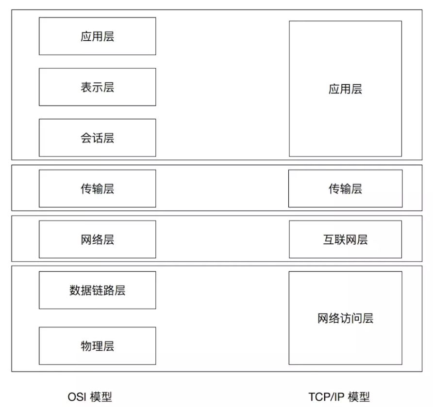
    * NginX：用软件在应用层实现负载均衡
    * HAProxy：用软件在传输层实现负载均衡
        - 工作在 4 层到 7 层的专业负载均衡软件, 支持的负载均衡算法丰富
    * 性能比较: F5 > LVS > **HaProxy > Nginx**
    
* 在软件负载均衡里，LVS 的优势

    - 常规负载均衡

        进出都要经过负载均衡服务器. 响应报文较大, 面对大量请求时负载均衡节点本身可能会成为瓶颈

        ```nginx
        发送请求: User -> LoadBalancer -> Server
        接收响应: User <- LoadBalancer <- Server
        ```

    - LVS DR 模式

        LoadBalancer 与 Server 同在一个网段, 共享同一个公网 IP, 响应报文可以由 Server 直达 User

        ```nginx
        发送请求: User -> LoadBalancer -> Server
        接收响应: User <───────────────── Server
        ```

* 可以不使用 Nginx, 直接用 gunicorn 吗？
  
    * 测试可以，正式不可以。
    * 功能上，gunicorn无法替代nginx
    * Nginx 相对于 Gunicorn 来说更安全
      * Nginx 可以用作负载均衡.
    
* 处理静态文件相关配置

    ```nginx
    location /statics/ {
        root   /project/bbs/;
        expires 30d;
        access_log off;
    }

    location /medias/ {
        root   /project/bbs/;
        expires 30d;
        access_log off;
    }
    ```
    
* 浏览器如何请求静态文件

    - 第一步先访问url，拿到html文件
    - 解析html文件，逐个请求里面的js/css/图片等资源
    
* 面试题：

    * Nginx如何做负载均衡？


## 自顶向下看架构：服务器架构

1. 架构研究的 5 个方面
  
    - 高性能：请求再多，也能服务
    - 高可用：情况再糟，也能服务
    - 可伸缩：请求多了能加服务器满足服务，请求少了也能减服务器省资源
      - 云服务里特别适用
  - 游戏服务器，每天中午和下午都是高峰
      - 伸缩：增加、减少相同的服务
    - 可扩展：能不断的加新的不同类型的服务
    - 安全性：完成以上能力的前提是，不出安全问题
    
2. 简单、实用的服务器架构图

    * 分层结构: 功能模块解耦合
    * 每层多台机器: 有效避免单点故障
    * 每层均可扩容: 能通过简单的方式提升服务器的性能、可用性、扛并发能力

    ```nginx
                   User Request         cli_ip(12.23.34.45)
                 |    |    |    |
                 V    V    V    V
                 www.example.com                -> 第一层
               Nginx         Nginx						 -> 云负载均衡
            115.2.3.11     115.2.3.12           
           /    |     \   /     |    \
          /     |       X       |     \
         V      V     V   V     V      V        -> 第二层
    AppServer  AppServer  AppServer  AppServer  -> Gunicorn+Django
    10.0.0.1   10.0.0.2   10.0.0.3   10.0.0.4   -> AppServer
    weight:10  weight:20  weight:20  weight:20  -> 权重
        |         |          |           |
        V         V          V           V
    +------------------------------------------+
    |           缓存层   主机 <--> 从机          |第三层
    +------------------------------------------+
        |         |          |           |
        V         V          V           V
    +------------------------------------------+
    |           数据库  主机 <--> 从机           |第四层
    +------------------------------------------+
    ```
    

## 从数据维度看架构：一个请求的完整流程

1. client端的一个请求

   1. 先做DNS，域名 -> IP
   2. 请求发到对应IP地址上的Web服务器，请求这个时候到了 NginX
   3. Nginx 根据 location 和 upstream 配置，将请求按规则分发给后边的某台应用服务器
      1. Gunicorn + Django 预先启动几个进程或协程，等待服务，一旦请求进来，就按Django程序处理流程工作
         1. urls.py 分配请求给对应的处理方法，后边就按python程序业务处理流程工作。
            1. 找到对应的处理方法，处理客户端请求。

2. 时序图：数据流图

   1. 代码：

      ```
      title Client / Server 请求时序图
      
      Client -> + local host: 查找
      note over local host: 1.1.1.1 domain.com\n127.0.0.1 localhost
      local host -> -Client: 命中与否 
      Client -> +DNS: DNS request
      DNS -> -Client: Get IP
      
      Client -> NginX: 动态请求: GET / HTTP/1.1
      
      note over NginX: nginx.conf:\nlocation /api{\n  proxy_pass http://up_api;}\nupstream up_api{\n  1.1.1.1 weight 5;\n  2.2.2.2 weight 5;}
      
      NginX -> +Gunicorn: upstream request
      note over Gunicorn : Django: \n  urls.py\nmapping:\n  Module.method()
      Gunicorn -> +Redis: query cache
      Redis -> -Gunicorn: hit / miss
      
      Gunicorn -> +MySQL: query sql
      MySQL -> -Gunicorn: get data
      
      Gunicorn -> Redis: write cache
      
      Gunicorn -> -NginX: render response
      
      NginX -> Client:response: HTTP/1.1 200 OK
      note over Client :  浏 览 器\n渲染页面
      
      ```

      

   2. 图片：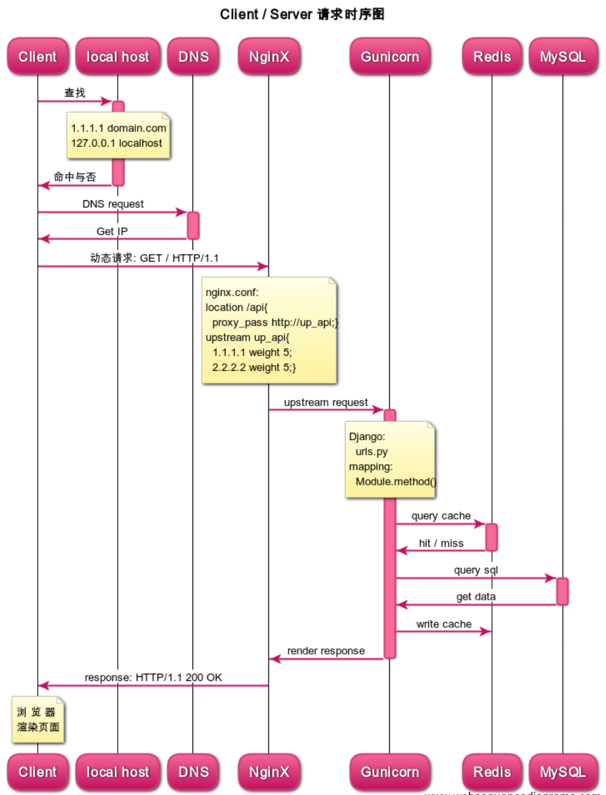

​	

## 从时间维度看架构：服务器架构的发展

- 服务发展史
  - live journel 
  - 豆瓣

* 早期服务器, 所有服务在一台机器

    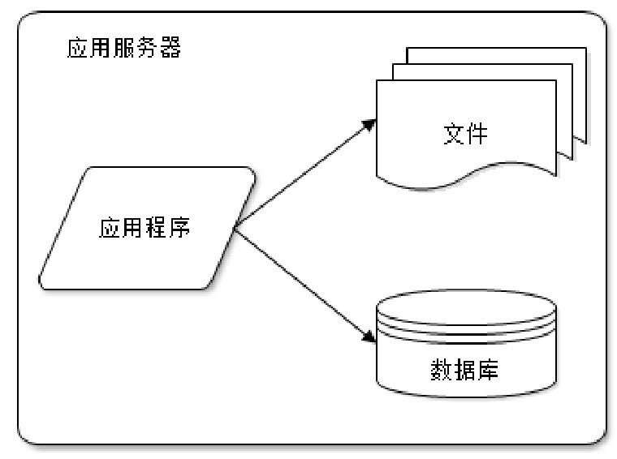

    <div style="page-break-after: always;"></div>

* 服务拆分, 应用、数据、文件等服务分开部署

    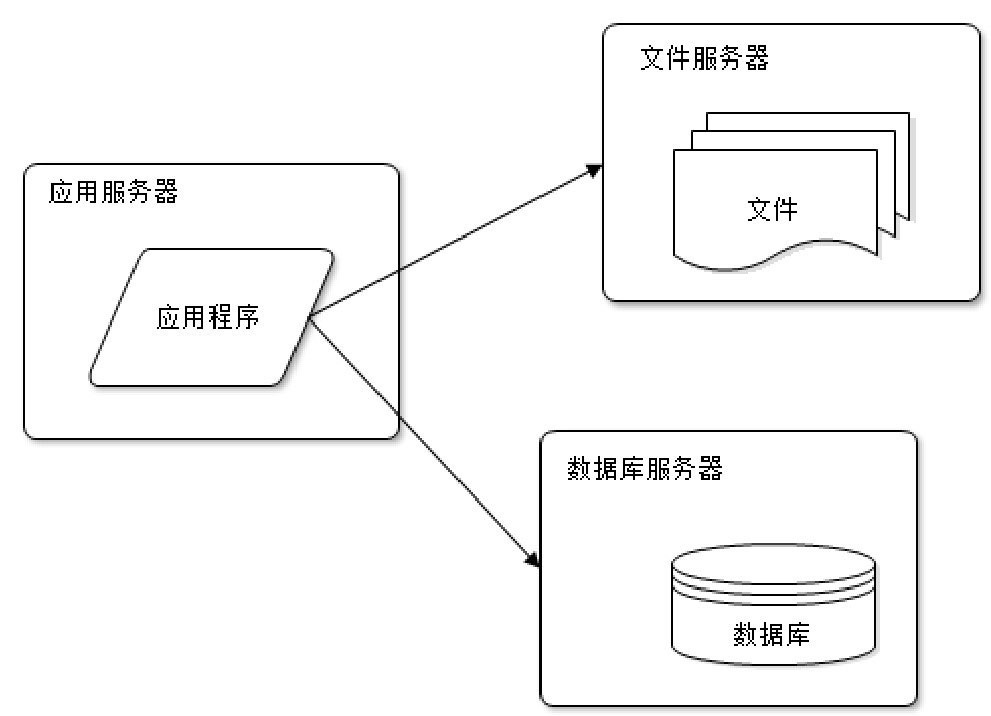

    <div style="page-break-after: always;"></div>

* 利用缓存提升性能

    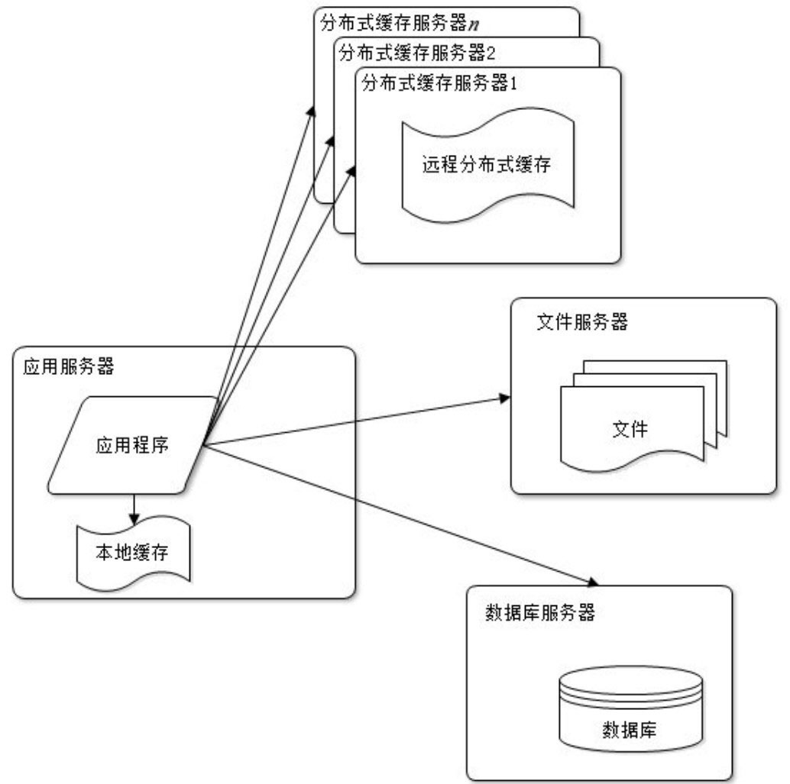

    <div style="page-break-after: always;"></div>

* 应用服务器分布式部署, 提升网站并发量和吞吐量

    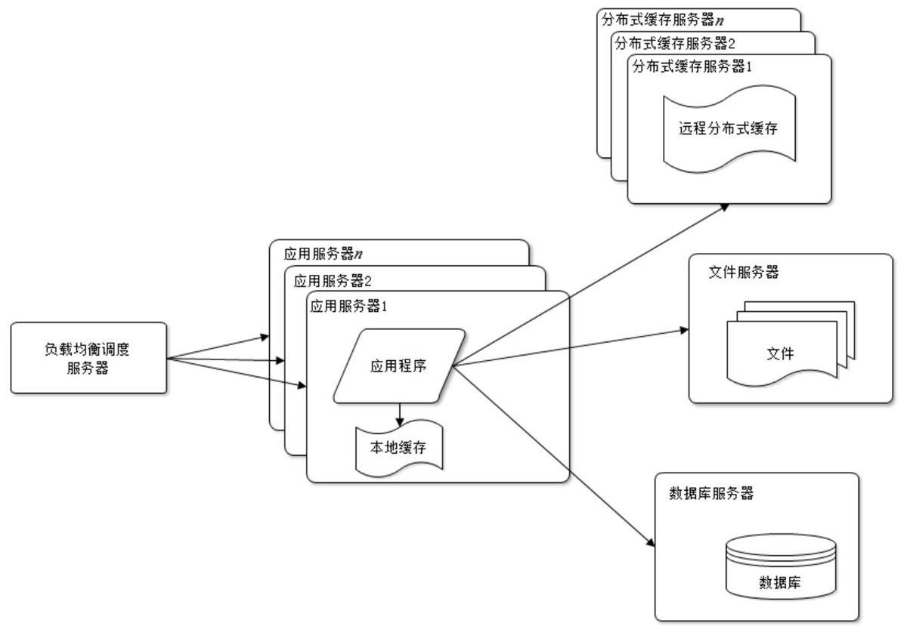

    <div style="page-break-after: always;"></div>

* 通过读写分离读写分离提升数据库性能和数据可靠性

    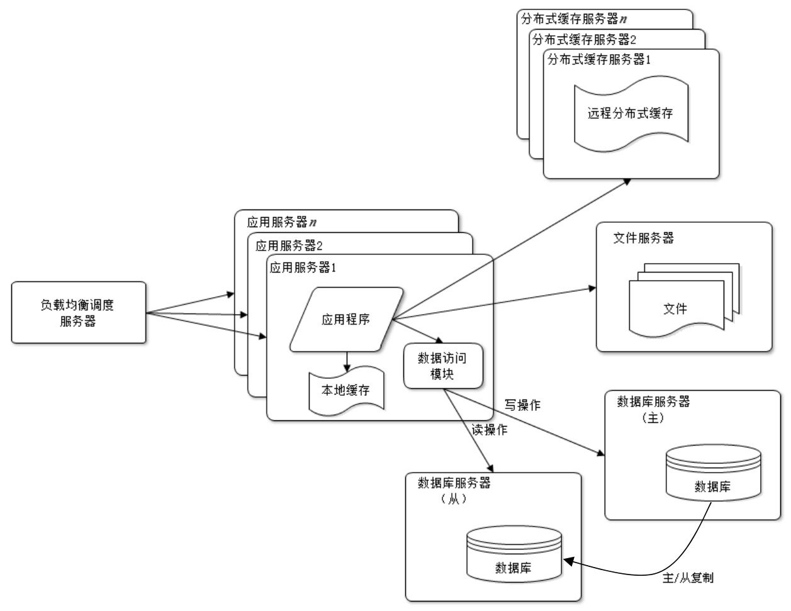

    <div style="page-break-after: always;"></div>

* 使用反向代理、CDN、云存储等技术提升静态资源访问速度, 并能有效提升不同地域的访问体验

    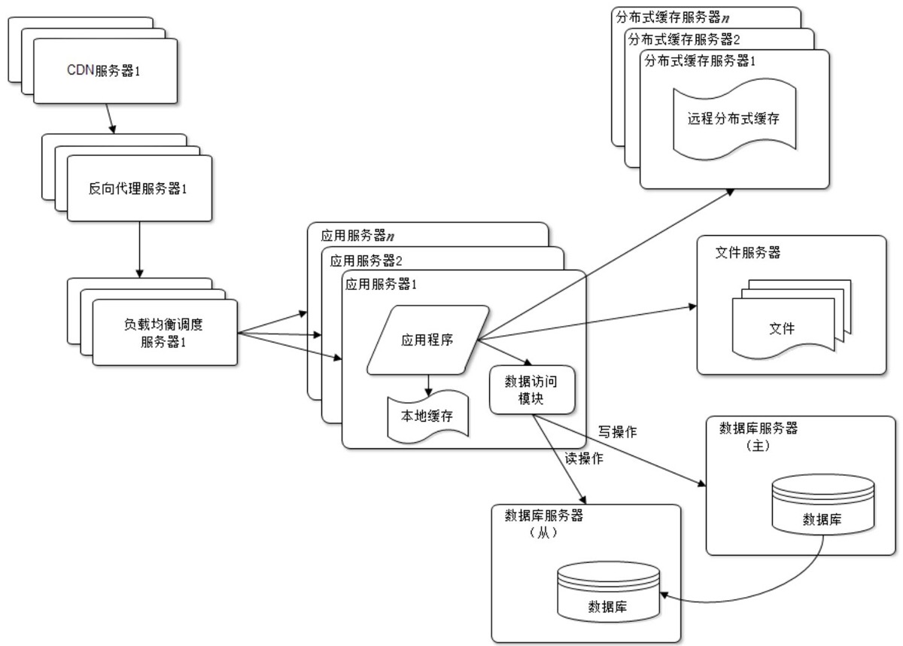

    <div style="page-break-after: always;"></div>

* 通过分布式数据库和分布式文件系统满足数据和文件海量存储需求, 并进一步提升数据可靠性

    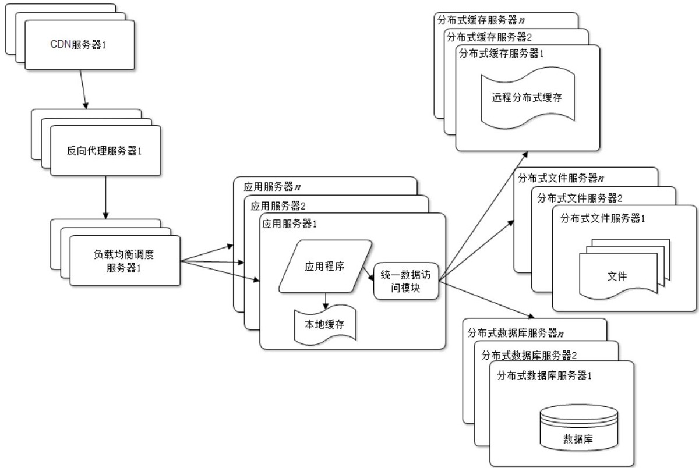

    <div style="page-break-after: always;"></div>

* 增加搜索引擎 和 NoSQL

    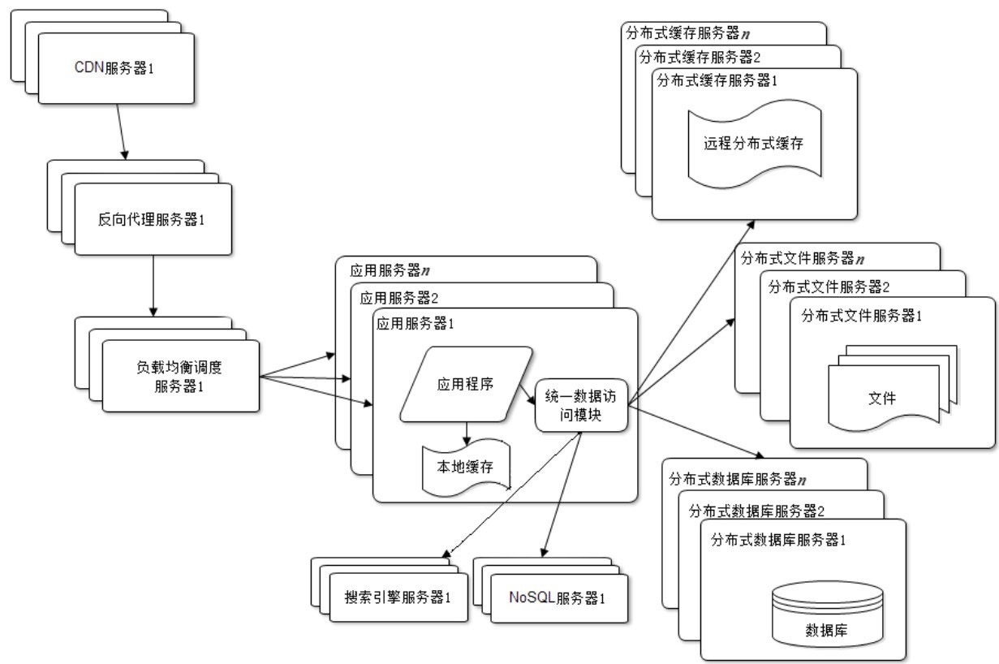

    <div style="page-break-after: always;"></div>

* 增加消息队列服务器, 让请求处理异步化

    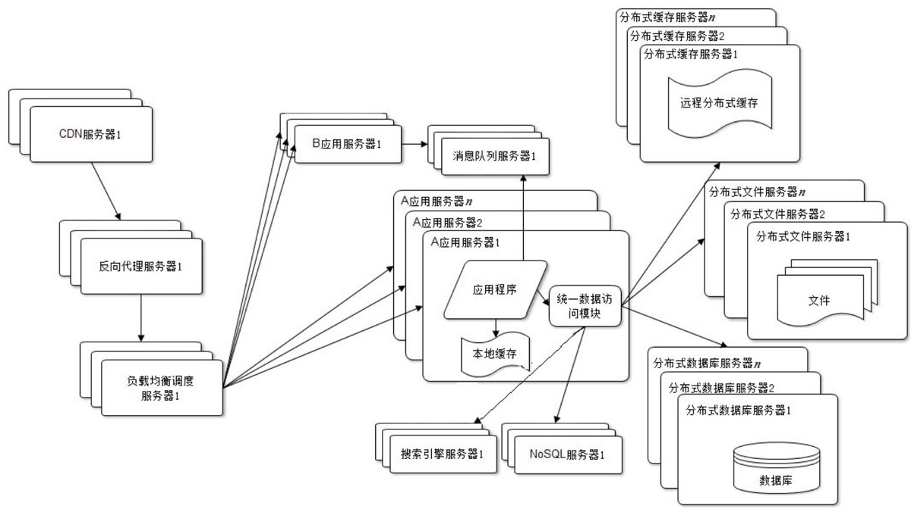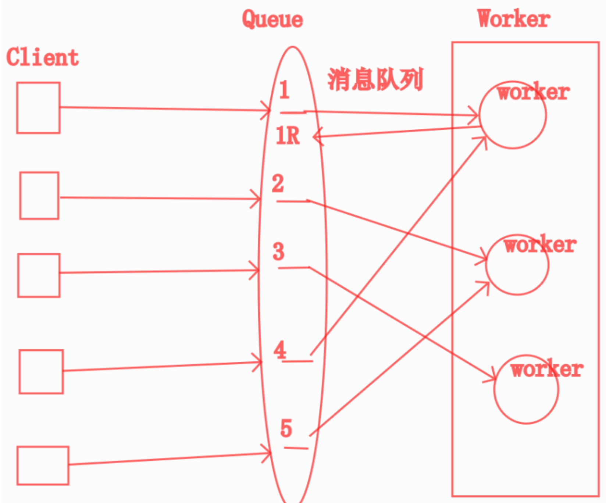

    <div style="page-break-after: always;"></div>

* 拆分应用服务器与内部服务

    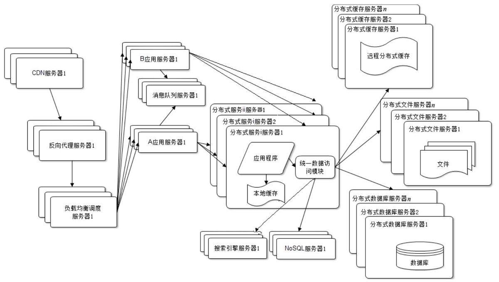

    <div style="page-break-after: always;"></div>

- 微服务
  - flask restful

## 架构的工作流程

1. 假定我们从第四步，分布式开始设计架构：
   1. 我们的架构，起步就有：
      1. 负载均衡服务器：Nginx Server
      2. 应用服务器：Application Server (Gunicorn + Django, Python server)
      3. 数据库服务器：MySQL
      4. 缓存服务器：Redis
   2. 配置服务器：
      1. Nginx Server
         
      2. Application Server
      
      3. Redis 
      
      4. MySQL
      
         

## 服务器计算

- 服务器性能预估

    1. 首先需知道网站日活跃 (DAU) 数据：1-10万
    2. 按每个活跃用户产生 100 个请求计算出 “每日总请求量”

        不同类型的网站请求量差异会很大, 可以自行调整一个用户产生的请求数

        ```
        每日总请求量 = DAU x 单个用户请求量
        ```

    3. 有了总请求量便可计算 “每日峰值流量”, 流量一般单位为 rps (requests per second)

        根据经验可知: 每天 80% 的请求会在 20% 的时间内到达

        由此可知:

        ```
                        每日总请求量 x 80%
        每日峰值流量 = ───────────────────────
                           86400 x 20%
        ```

    4. 一般带负载的 web 服务器吞吐量约为 300rps, 所以:

        ```
        WebServer 数量 = 每日峰值流量 / 300
        ```

    5. 得到 WebServer 数量以后, 再根据用户规模和请求量估算 Nginx、Cache、Database 等服务器的数量

- 真实工作中服务器分配情况

    - 业务类型：
        1. 新闻网站：单用户产生请求：30 - 50
        2. 游戏网站：单用户请求可能：100 - 500
        3. 社区网站：单用户请求可能：50 - 100
        4. 平均可以取 100 
    - 每日总请求 = DAU * 单用户每日请求
        1. DAU 20万：200000 * 100 = 20,000,000 两千万
        2. DAU 50万：5000 万
        3. DAU 100万：1亿
        4. DAU 200万：2亿
    - 峰值请求：
        1. 按经验所有请求在10小时内发生
           1. 峰值请求 = 每日总请求 / 10 / 3600
              1. 20万：20000000 / (10 * 3600) = 556
              2. 100万：556 * 5
              3. 200万：
        2. 按80%的请求在20%的时间内发生
           1. 峰值请求 = 每日总请求 * 80% / (24 * 20%)
              1. 20万DAU：926次/秒
    - 服务器预估
        1. 单 Web 服务器并发 500 rps
           1. 20万：峰值请求 / 500 = 2台
           2. 100万：556 * 5 / 500 = 6台
    - 相册服务
        1. 业务限制用户照片，或者等用户上传后自动帮用户压缩
           1. 5M = 500kB
        2. 预估每个用户多少张照片：
           1. 500张
           2. 2000张
        3. 每张照片多大 2-9
           1. 平均5M
        4. 一个用户总空间多少？
           1. 500 * 5MB = 2500MB = 2.5GB
           2. 2000 * 5MB = 10GB
        5. 每个服务器存多少张照片
           1. 10TB = 1000GB = 1000个用户
           2. 20万 200台服务器
        6. 用户20万
        7. 用户100万
        8. 用户200万

- 面试题：

    - 你们有多少用户？
    - 多少日活？
    - 多少服务器？
    - 服务器并发有多高？
